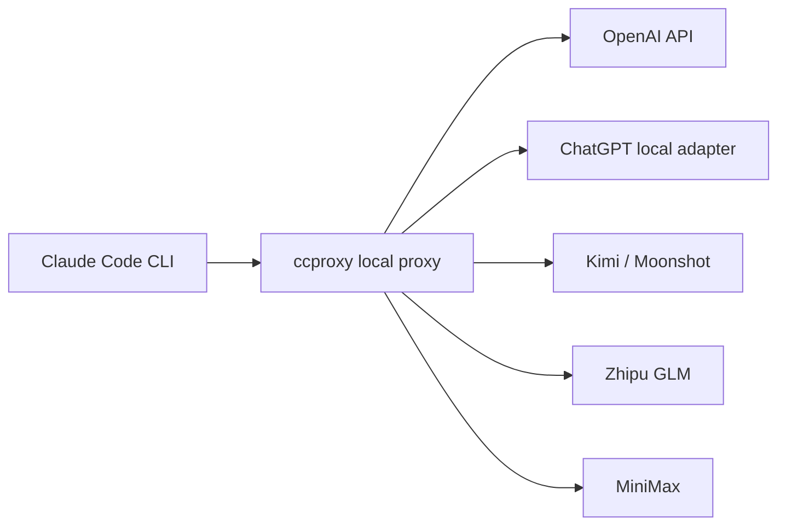

# claude-code-proxy

[English](README.md) | [简体中文](README.zh-CN.md)


`claude-code-proxy` lets Claude Code CLI use OpenAI-compatible or
Anthropic-compatible providers through one local command: `ccproxy`.

The normal workflow is command-first:

```cmd
ccproxy init
ccproxy model set
ccproxy run -- -p "reply ccproxy-ok"
```

`ccproxy init` writes config, runs model selection, and prepares the selected
provider. `ccproxy model set` can be used later to switch provider/model. If a
provider is not configured yet, `ccproxy` opens the relevant login or API-key
page before saving the selection. You can pick a configured model or type any
upstream model name, such as `ChatGPT5.5`, `ChatGPT5.4`, or a model exposed by
your own adapter.



## Install

Requires Python 3.11+ and Claude Code CLI.

From GitHub:

```sh
python -m pip install git+https://github.com/shuaishuaiZhu-ai/claude-code-proxy.git
```

From a cloned checkout:

```sh
python -m pip install -e .
```

Check the command:

```sh
ccproxy --version
```

If `ccproxy` is not on `PATH`, use the module form:

```sh
python -m ccproxy --version
python -m ccproxy model set
```

## Windows Quick Start

PowerShell:

```powershell
$env:OPENAI_API_KEY="your-openai-api-key"
ccproxy model set
ccproxy model current
ccproxy run -- -p "reply ccproxy-ok"
```

CMD:

```cmd
set OPENAI_API_KEY=your-openai-api-key
ccproxy model set
ccproxy model current
ccproxy run -- -p "reply ccproxy-ok"
```

If PowerShell blocks `claude.ps1`, `ccproxy run` automatically prefers the npm
`claude.cmd` shim on Windows.

## ChatGPT Subscription Adapter

`chatgpt-subscription` is a managed adapter mode. `ccproxy` installs and runs
the local adapter for you using
[auth2api](https://github.com/AmazingAng/auth2api), then routes Claude Code
through that adapter.

During setup, `ccproxy` uses OpenAI Codex device-code login by default. It
prints a verification URL and one-time code, then waits while you finish login
in any browser. This avoids the fragile `localhost:1455` browser callback used
by the older Codex consent flow. By default, the managed adapter runs at:

```text
http://127.0.0.1:8317/v1/chat/completions
```

First-time setup:

```cmd
ccproxy init
ccproxy run -- -p "reply ccproxy-ok"
```

When prompted, choose `chatgpt-subscription`, then type the model name you want,
for example `ChatGPT5.5`. `ccproxy` maps that friendly name to auth2api's
current `gpt-5.5` model id.

Non-interactive form:

```cmd
ccproxy model set --provider chatgpt-subscription --model ChatGPT5.5
ccproxy run -- -p "reply ccproxy-ok"
```

`ccproxy init`, `ccproxy model set`, `ccproxy serve`, and `ccproxy run` all try
to prepare the managed adapter when `chatgpt-subscription` is active. On
Windows, the installer uses `npm.cmd` instead of `npm.ps1`, avoiding PowerShell
execution-policy failures.

To force the older browser callback flow, add `--browser-login`. Use this only
when you specifically want the Codex consent page and `localhost:1455` callback
behavior:

```cmd
ccproxy model set --provider chatgpt-subscription --model ChatGPT5.5 --browser-login
```

## macOS / WSL / Linux

```sh
export OPENAI_API_KEY="your-openai-api-key"
ccproxy model set
ccproxy run -- -p "reply ccproxy-ok"
```

For WSL, keep Claude Code, `ccproxy`, and any local adapter in the same
environment when possible. If your adapter runs on Windows and `ccproxy` runs
inside WSL, edit the profile `base_url` to an address reachable from WSL.

## Provider Profiles

| Mode | Profile | Key env | Notes |
| --- | --- | --- | --- |
| OpenAI API key | `openai-key` | `OPENAI_API_KEY` | Direct OpenAI Chat Completions |
| ChatGPT subscription adapter | `chatgpt-subscription` | managed local key | Managed auth2api adapter |
| Kimi / Moonshot API | `kimi` | `KIMI_API_KEY` | OpenAI-compatible |
| Zhipu GLM API | `zhipu` | `ZHIPU_API_KEY` | OpenAI-compatible |
| MiniMax CN | `minimax-cn` | `MINIMAX_API_KEY` | OpenAI-compatible |
| MiniMax Global | `minimax-global` | `MINIMAX_API_KEY` | OpenAI-compatible |
| MiniMax Anthropic CN | `minimax-cn-anthropic` | `MINIMAX_API_KEY` | Anthropic-compatible passthrough |
| MiniMax Anthropic Global | `minimax-global-anthropic` | `MINIMAX_API_KEY` | Anthropic-compatible passthrough |
| Custom adapter | `custom` | `CCPROXY_CUSTOM_API_KEY` | Local OpenAI-compatible adapter |

## Model Commands

Interactive:

```sh
ccproxy model set
```

The setup order is:

1. choose provider
2. configure provider if needed
3. choose model
4. save active provider/model

For `chatgpt-subscription`, step 2 runs the managed auth2api login/start flow.
For API-key providers such as `openai-key`, `kimi`, `zhipu`, and `minimax-cn`,
step 2 opens the provider console if the required environment variable is
missing, then prints the exact environment variable command to run. `ccproxy`
does not save API keys to project files.

Non-interactive:

```sh
ccproxy model set --provider chatgpt-subscription --model ChatGPT5.5
ccproxy model current
ccproxy model clear
```

If you are on a headless machine or do not want a browser to open:

```sh
ccproxy model set --provider openai-key --model gpt-4.1 --no-open-login
```

One-off override without saving:

```sh
ccproxy run --upstream-model ChatGPT5.4 -- -p "reply ccproxy-ok"
```

State files:

- `~/.ccproxy/active.toml`: active provider profile
- `~/.ccproxy/models.toml`: active upstream model per provider

Neither file stores API keys.

## Claude Code Environment

When `ccproxy run` starts Claude Code, it sets these child-process variables:

```text
ANTHROPIC_BASE_URL=http://127.0.0.1:8082
ANTHROPIC_API_KEY=ccproxy
ANTHROPIC_AUTH_TOKEN=ccproxy
```

This prevents an existing real Anthropic key from leaking into a proxy run.

Two-terminal mode is also supported:

```sh
ccproxy serve --profile openai-key
```

Then run Claude Code with the same endpoint:

```sh
ANTHROPIC_BASE_URL=http://127.0.0.1:8082 ANTHROPIC_API_KEY=ccproxy ANTHROPIC_AUTH_TOKEN=ccproxy claude --bare
```

## Smoke Tests

Local translator test:

```sh
ccproxy test
```

Real Claude Code smoke test:

```sh
ccproxy test --profile custom --claude
```

The real Claude smoke test launches Claude Code and sends `reply ccproxy-ok`.
For `chatgpt-subscription`, `ccproxy` starts the managed adapter first.

For a local fake adapter from a cloned checkout:

```cmd
python scripts\mock_openai_provider.py --port 8000
ccproxy model set --provider custom --model custom-big
ccproxy test --profile custom --claude
```

Expected output:

```text
ccproxy-ok
```

## Troubleshooting

If `ccproxy run -- -p "reply ccproxy-ok"` prints no model answer, check the
active provider first:

```sh
ccproxy model current
```

For `chatgpt-subscription`, run `ccproxy init` or `ccproxy model set`; this
installs auth2api, starts the ChatGPT/Codex device-code login flow, and launches
the local adapter. For API-key providers, run `ccproxy model set`; if the required
environment variable is missing, it opens the provider setup page and refuses to
save an unusable selection. For `custom`, you still own the adapter process. A
plain `claude` command is not the same as `ccproxy run`; it starts normal Claude
Code auth and may show `Not logged in`.

If the browser stays on the "Sign in with ChatGPT to Codex" consent page, or the
continue button spins forever, you are on the older browser callback flow. Stop
that login and rerun without `--browser-login`; the default device-code login
does not use the consent callback page. You can also inspect the state with:

```sh
ccproxy doctor --profile chatgpt-subscription
```

`chatgpt_auth_https: ... cloudflare_challenge` means the flow is blocked on the
OpenAI/Codex web login step before any `localhost` callback happens, so the
proxy has not received anything yet. Check browser extensions, privacy or ad
blockers, and the system proxy or VPN, or use the default device-code login.
`codex_callback_port_1455: busy` is only relevant to `--browser-login`; device
code login does not use that port.

If ChatGPT login exits with `EADDRINUSE` on `127.0.0.1:1455`, another process
already owns the Codex OAuth callback port. Newer `ccproxy` builds detect this
before login and fall back to auth2api manual callback mode; paste the full
`localhost:1455/auth/callback?...` URL from the browser if prompted.

## Config

Create a user config:

```sh
ccproxy init
```

Example profile:

```toml
default_profile = "openai-key"

[server]
host = "127.0.0.1"
port = 8082

[profiles.openai-key]
type = "openai-compatible"
base_url = "https://api.openai.com/v1"
api_key_env = "OPENAI_API_KEY"

[profiles.openai-key.models]
big = "gpt-4.1"
middle = "gpt-4.1-mini"
small = "gpt-4.1-nano"
```

Profile types:

- `openai-compatible`: translate Anthropic Messages to OpenAI Chat Completions.
- `anthropic-compatible`: forward Anthropic Messages with auth/model mapping.
- `external-adapter`: OpenAI-compatible wire shape. `chatgpt-subscription` is
  managed by `ccproxy`; `custom` is user-managed.

See [docs/providers.md](docs/providers.md) and
[examples/ccproxy.example.toml](examples/ccproxy.example.toml).

## Development

```sh
python -m pip install -e .
python -m unittest discover -s tests
python -m compileall -q src tests scripts
```

Optional FastAPI mode:

```sh
python -m pip install ".[server]"
ccproxy serve --fastapi
```

## License

MIT. See [LICENSE](LICENSE).

Third-party names, platform marks, and documentation imagery belong to their
respective owners. This project is independent and is not affiliated with
OpenAI, Anthropic, MiniMax, Moonshot AI, Zhipu AI, Microsoft, Apple, or Linux
distributors.
