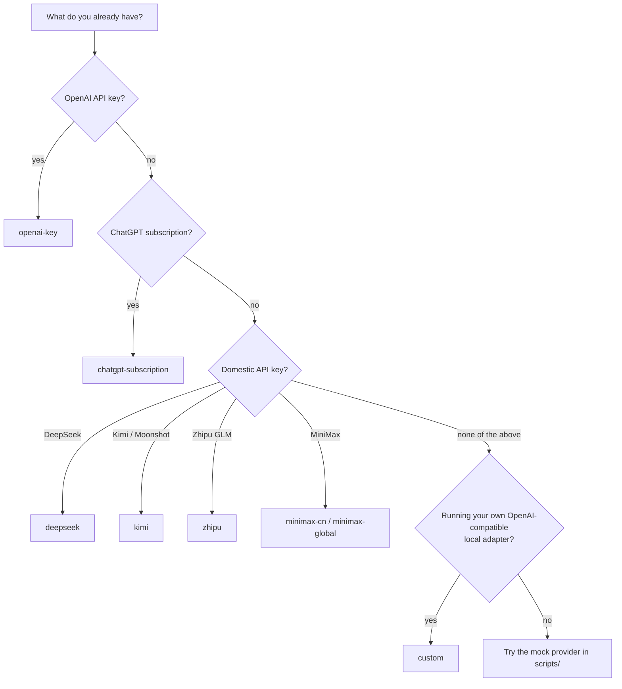
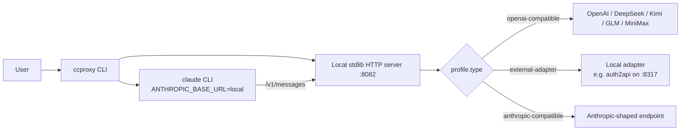

<!--
README rewrite (see docs/architecture-review.md for the audit it ties into).
Goals: faster value prop above the fold, a 30-second TL;DR, a decision tree
instead of a 14-row table, an FAQ, and a clear contributor path.
Removed: the 6× repetition of `ccproxy run -- -p "reply ccproxy-ok"`, the
implementation detail about hidden MiniMax Anthropic profiles (moved to wiki),
and the early dump of every provider's API-key URL (kept further down so it
doesn't crowd the first page).
Added: hero tagline, badges (with TODO markers where infra isn't ready yet),
mermaid architecture + decision diagrams, ASCII demo, FAQ, contributor section,
roadmap. README.zh-CN.md mirrors this structure.
-->

# claude-code-proxy

**One `ccproxy` command. Claude Code, your provider.**

[English](README.md) · [简体中文](README.zh-CN.md)


`ccproxy` is a tiny local proxy that lets [Claude Code][cc] talk to any
provider you have access to — OpenAI, your ChatGPT subscription, DeepSeek,
Kimi, Zhipu GLM, MiniMax, or a local adapter you wrote yourself.

You install it once, pick a provider, and run `ccproxy run …` instead of
`claude …`. Claude Code's tools, plugins, and skills keep working.

[cc]: https://docs.anthropic.com/en/docs/claude-code

<!-- TODO badges — re-enable once PyPI + CI badges are set up.
[](https://pypi.org/project/claude-code-proxy/)
[](https://github.com/shuaishuaiZhu-ai/claude-code-proxy/actions)
-->


---

## 30-second TL;DR

```sh
git clone https://github.com/shuaishuaiZhu-ai/claude-code-proxy.git
cd claude-code-proxy
sh scripts/install.sh             # Windows: powershell -ExecutionPolicy Bypass -File .\scripts\install.ps1
ccproxy model set                 # pick provider + model (paste API key if asked)
ccproxy run -- -p "reply ccproxy-ok"
```

Got `ccproxy-ok` back? You're done. Skip to [Switch provider or model](#switch-provider-or-model).

> 🛈 PyPI distribution is on the roadmap. Until then, install from git.

---

## Why ccproxy

| Without ccproxy | With ccproxy |
|---|---|
| Claude Code only talks to Anthropic | Same Claude Code, any provider |
| Re-edit env vars to switch providers | `ccproxy model set` and keep going |
| ChatGPT subscription unusable from CLI | Managed `auth2api` adapter handles login |
| Mix-and-match means writing your own proxy | 14 providers ready, plus a `custom` slot |

It doesn't:

- Steal or upload your keys. Everything runs on `127.0.0.1`. See [SECURITY.md](SECURITY.md).
- Turn a ChatGPT Plus/Pro plan into an OpenAI API key. ChatGPT mode logs into *your* account in *your* browser.
- Disable Claude Code's plugins, skills, or MCP. Normal `ccproxy run` keeps them on. Use `--bare` only for smoke tests.

---

## Pick a provider



<details>
<summary>Full provider table (14 profiles, including subscription adapters)</summary>

| You have | Choose | Mode | Example model |
| --- | --- | --- | --- |
| OpenAI API key | `openai-key` | API key | `gpt-4.1`, `gpt-4.1-mini` |
| ChatGPT subscription | `chatgpt-subscription` | Managed adapter | `ChatGPT5.5`, `ChatGPT5.4` |
| DeepSeek API key | `deepseek` | API key | `deepseek-v4-pro`, `deepseek-v4-flash` |
| DeepSeek subscription adapter | `deepseek-subscription` | Local adapter | adapter model |
| Kimi / Moonshot API key | `kimi` | API key | `moonshot-v1-128k` |
| Kimi subscription adapter | `kimi-subscription` | Local adapter | adapter model |
| Zhipu GLM API key | `zhipu` | API key | `glm-4-plus`, `glm-4-air` |
| Zhipu subscription adapter | `zhipu-subscription` | Local adapter | adapter model |
| MiniMax China API key | `minimax-cn` | API key | `MiniMax-M2.7` |
| MiniMax Global API key | `minimax-global` | API key | `MiniMax-M2.7` |
| MiniMax Token Plan | `minimax-subscription` | Subscription key | `MiniMax-M2.7` |
| Your own adapter | `custom` | Local adapter | adapter model |

Anthropic-compatible MiniMax profiles (`minimax-cn-anthropic`,
`minimax-global-anthropic`) exist for advanced users. They are hidden from
the normal menu. See the [Wiki](wiki/Providers-And-Models.md) for details.
</details>

---

## 5-minute walkthrough

### 1. First run

```sh
$ ccproxy model set
Choose provider:
1.   chatgpt-subscription (external-adapter)
2. * deepseek (openai-compatible)
3.   kimi (openai-compatible)
...
Provider number or name: 2
Choose model for deepseek:
1. big: deepseek-v4-pro
2. middle: deepseek-v4-flash
3. small: deepseek-v4-flash
Or type any custom upstream model name, for example ChatGPT5.5.
Model number, alias, or custom model name: big
active provider: deepseek
active model: deepseek-v4-pro
```

If a key is missing, ccproxy prints the right page and waits for you to
paste it. The pasted key is saved to `~/.ccproxy/secrets.toml` with
permissions tightened (`0o600` on POSIX; Windows ACLs are a known gap, see
[Architecture Review §7.2](docs/architecture-review.md#72-secrets-are-plaintext-0o600-is-a-no-op-on-windows-p2-m-independent)).

### 2. Run Claude Code through ccproxy

Everything after `--` is forwarded to `claude`:

```sh
ccproxy run -- -p "summarize this repository"
ccproxy run -- --model sonnet -p "reply ccproxy-ok"
```

ccproxy launches the local proxy on `127.0.0.1:8082`, sets
`ANTHROPIC_BASE_URL` so Claude Code points at it, and waits for `claude` to
exit.

### 3. Switch provider or model

Run `ccproxy model set` again any time:

```sh
ccproxy model set                                              # interactive
ccproxy model set --provider chatgpt-subscription --model ChatGPT5.5
ccproxy model set --provider kimi --model moonshot-v1-128k
ccproxy model current
```

State lives in `~/.ccproxy/active.toml` and `~/.ccproxy/models.toml`.

### 4. Quick sanity check

```sh
ccproxy doctor
```

Prints versions, the active profile, key state, Claude CLI location, and
(for `chatgpt-subscription`) the managed adapter health.

---

## Install

### macOS / Linux / WSL

```sh
sh scripts/install.sh                         # default
sh scripts/install.sh --with-server           # also install FastAPI/uvicorn
sh scripts/install.sh --no-init               # skip writing default config
```

### Windows PowerShell

```powershell
powershell -ExecutionPolicy Bypass -File .\scripts\install.ps1
powershell -ExecutionPolicy Bypass -File .\scripts\install.ps1 -WithServer
```

Both scripts:

1. Check for Python 3.11+ and `pip`.
2. Warn (not fail) if the `claude` CLI isn't on PATH yet.
3. Run `pip install -e .` from the cloned repo.
4. Call `ccproxy init --skip-model-set` to create the default config.

You usually do not need `--with-server`; the proxy works with the stdlib
HTTP server. ChatGPT subscription mode additionally needs **Node.js 20+**
and **git** — install those before picking `chatgpt-subscription`.

### Uninstall

```sh
sh scripts/uninstall.sh                       # also removes ~/.ccproxy
sh scripts/uninstall.sh --keep-state          # keep ~/.ccproxy
```

```powershell
powershell -ExecutionPolicy Bypass -File .\scripts\uninstall.ps1
```

Neither removes Python, pip, Node, git, or Claude Code.

---

## 🚑 Troubleshooting

Run `ccproxy doctor` first. Then look up the symptom.

| Symptom | Likely cause | Fix |
| --- | --- | --- |
| `Not logged in` from Claude Code | You ran plain `claude`, not `ccproxy run` | Use `ccproxy run -- …` so `ANTHROPIC_BASE_URL` is set |
| `/skills` shows nothing | `--bare` was passed | Drop `--bare`; it's for smoke tests only |
| `Invalid tool parameters` | Stale install | Update ccproxy; new builds validate tool calls before forwarding |
| API key setup exits immediately | Empty key pasted | Run `ccproxy model set` again and paste the actual key |
| Browser consent page hangs | Browser callback flow blocked | Stop the run and use default device-code login (no `--browser-login`) |
| `EADDRINUSE` on port 1455 | Another callback listener running | Close it, then rerun `ccproxy model set` |
| Adapter unreachable | Local subscription adapter isn't running | Start it, or switch to that platform's API-key provider |
| `PowerShell blocks .ps1` | Local execution policy | Use the installed `ccproxy` command, or pass `-ExecutionPolicy Bypass` to the install script |

For ChatGPT subscription specifically:

```sh
ccproxy doctor --profile chatgpt-subscription
```

This adds adapter install state, login state, callback port status, and
Cloudflare-challenge hints to the output.

### Port conflicts

Default proxy port is `8082`. ChatGPT subscription's managed adapter
listens on `8317`. Override with:

```sh
ccproxy run --port 8090 -- -p "reply ccproxy-ok"
```

### Try without any real provider

```sh
python scripts/mock_openai_provider.py --port 8000
ccproxy model set --provider custom --model custom-big
ccproxy run -- -p "reply ccproxy-ok"
```

---

## ❓ FAQ

**Can I try it without an API key?**
Yes — the bundled `scripts/mock_openai_provider.py` exposes a fake
OpenAI-compatible endpoint. Point the `custom` profile at it.

**Where do my API keys go?**
`~/.ccproxy/secrets.toml`, mode `0o600` on POSIX. Environment variables
(`OPENAI_API_KEY`, `DEEPSEEK_API_KEY`, …) still work and take priority.
The proxy never logs key values.

**Is this how I get an OpenAI API key from my ChatGPT Plus subscription?**
No. ChatGPT subscription mode uses *your* browser/OAuth login. It does not
mint an OpenAI Platform API key. Use `openai-key` with `OPENAI_API_KEY`
for the Platform API.

**Does it disable Claude Code's plugins / skills / MCP?**
No. Normal `ccproxy run` leaves them on. `--bare` is only for the minimal
smoke-test path.

**Why a proxy instead of editing `~/.claude/config`?**
Claude Code talks the Anthropic Messages protocol. Most providers speak
OpenAI Chat Completions. The proxy translates streaming, tool calls, tool
schemas, and assistant content blocks both ways — see
[docs/architecture.md](docs/architecture.md).

**Does this support local models / Ollama?**
Indirectly. Point any OpenAI-compatible local server at the `custom`
profile (default `http://127.0.0.1:8000/v1`).

**Why is the repo named `claude-code-proxy` but the command is `ccproxy`?**
Repo describes the role; the CLI name is short for daily use.

**How do I add a new provider?**
For a one-off, add a `[profiles.your-name]` block to
`~/.ccproxy/config.toml` — see [`examples/ccproxy.example.toml`](examples/ccproxy.example.toml).
For a built-in provider, edit `src/ccproxy/presets.py` and open a PR (tests
in `tests/test_provider_setup.py` cover the shape).

---

## 🛠 Architecture in one diagram



For details on streaming, tool-call translation, and state files, see
[docs/architecture.md](docs/architecture.md) and the
[Wiki Architecture page](wiki/Architecture.md).

---

## Contributing

The code is small (~90 KB of Python, zero runtime deps). A good place to
start:

| You want to… | Touch this |
| --- | --- |
| Add a built-in provider | `src/ccproxy/presets.py` + `src/ccproxy/provider_setup.py` + a test in `tests/test_provider_setup.py` |
| Fix a translation bug | `src/ccproxy/translator.py` + add a case to `tests/test_translator.py` |
| Improve the ChatGPT subscription flow | `src/ccproxy/adapter.py` |
| Make the CLI nicer | `src/ccproxy/cli.py` |

Before opening a PR:

```sh
python -m pip install -e .
python -m unittest discover -s tests
python -m compileall -q src tests scripts
```

`docs/architecture-review.md` lists the technical debt I'd most like help
with — pick any P1/P2 you find interesting. See [CONTRIBUTING.md](CONTRIBUTING.md)
for the full checklist.

---

## Roadmap

The project is at **0.1.0** — interfaces are stable enough to use daily,
not yet stable enough to depend on from another library.

Planned next:

- [ ] Publish to PyPI (`pip install claude-code-proxy`)
- [ ] CI matrix across Windows + macOS + Linux
- [ ] Pin `auth2api` to a tagged release (supply-chain hardening)
- [ ] Replace `print()` with `logging` (`--debug` / `--quiet`)
- [ ] `ccproxy doctor --fix`
- [ ] Optional `keyring`-backed secret storage

See [`docs/architecture-review.md`](docs/architecture-review.md) for the
full punch list and the dependency graph between items.

---

## Links

- 📚 Wiki: [Home](wiki/Home.md) · [Quick Start](wiki/Quick-Start.md) · [Providers](wiki/Providers-And-Models.md) · [Architecture](wiki/Architecture.md) · [Subscription Login](wiki/Subscription-Login.md) · [Troubleshooting](wiki/Troubleshooting.md) · [Testing](wiki/Testing.md)
- 🧠 Architecture notes: [docs/architecture.md](docs/architecture.md)
- 📋 Architecture review: [docs/architecture-review.md](docs/architecture-review.md)
- 🔌 Provider details: [docs/providers.md](docs/providers.md)
- ⚙ Example config: [examples/ccproxy.example.toml](examples/ccproxy.example.toml)
- 🤝 Contributing: [CONTRIBUTING.md](CONTRIBUTING.md)
- 🔐 Security: [SECURITY.md](SECURITY.md)

## License

MIT. See [LICENSE](LICENSE).
