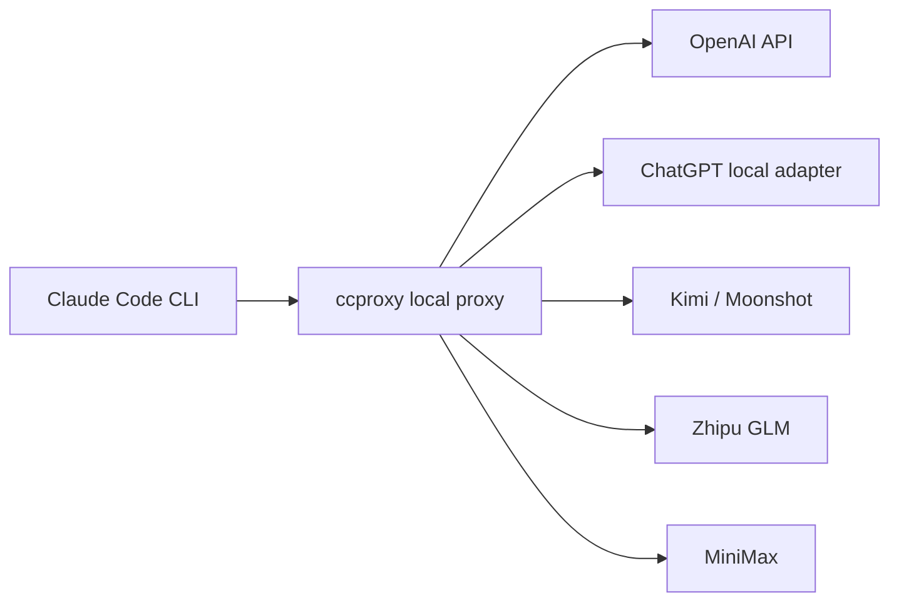

# claude-code-proxy


`claude-code-proxy` lets Claude Code CLI talk to providers that expose OpenAI
or Anthropic-compatible APIs. The local command is `ccproxy`.

Use it when you want Claude Code as the coding interface, but you want to choose
the backend from profiles such as OpenAI API, ChatGPT local adapter, Kimi,
Zhipu GLM, MiniMax, or a custom adapter.



## 30-second Windows start

```cmd
cd /d C:\path\to\claude-code-proxy
scripts\ccproxy-switch.cmd openai-key
scripts\ccproxy-current.cmd
scripts\ccproxy-run.cmd
```

Set the matching key first:

```powershell
$env:OPENAI_API_KEY="your-openai-api-key"
```

## Switch providers

```cmd
scripts\ccproxy-switch.cmd openai-key
scripts\ccproxy-switch.cmd chatgpt-subscription
scripts\ccproxy-switch.cmd kimi
scripts\ccproxy-switch.cmd zhipu
scripts\ccproxy-switch.cmd minimax-cn
```

Then run through the active provider:

```cmd
scripts\ccproxy-current.cmd
scripts\ccproxy-run.cmd -p "reply ccproxy-ok"
```

## macOS / WSL / Linux

```sh
scripts/ccproxy-switch.sh openai-key
scripts/ccproxy-run.sh
```

For installed package usage without repository scripts:

```sh
ccproxy use openai-key
ccproxy current
ccproxy run -- claude --bare --model sonnet
```

## Install

From GitHub:

```sh
python -m pip install git+https://github.com/shuaishuaiZhu-ai/claude-code-proxy.git
```

From a cloned checkout:

```sh
python -m pip install -e .
```

The default runtime path uses only the Python standard library. Optional FastAPI
serving is available if you install `fastapi` and `uvicorn`.

## Profiles

| Mode | Profile | Key env | Notes |
| --- | --- | --- | --- |
| OpenAI API key | `openai-key` | `OPENAI_API_KEY` | Direct OpenAI Chat Completions |
| ChatGPT subscription adapter | `chatgpt-subscription` | `CHATGPT_ADAPTER_API_KEY` | Local OpenAI-compatible adapter required |
| Kimi / Moonshot API | `kimi` | `KIMI_API_KEY` | OpenAI-compatible |
| Zhipu GLM API | `zhipu` | `ZHIPU_API_KEY` | OpenAI-compatible |
| MiniMax CN | `minimax-cn` | `MINIMAX_API_KEY` | OpenAI-compatible |
| MiniMax Global | `minimax-global` | `MINIMAX_API_KEY` | OpenAI-compatible |
| MiniMax Anthropic CN | `minimax-cn-anthropic` | `MINIMAX_API_KEY` | Anthropic-compatible passthrough |
| MiniMax Anthropic Global | `minimax-global-anthropic` | `MINIMAX_API_KEY` | Anthropic-compatible passthrough |
| Custom adapter | `custom` | `CCPROXY_CUSTOM_API_KEY` | Local OpenAI-compatible adapter |

`ccproxy use <profile>` writes only the active profile name to
`~/.ccproxy/active.toml`. API keys stay in environment variables.

## Subscription account boundary

`chatgpt-subscription` means "route Claude Code to a local adapter that you run".
It does not mean this project logs into ChatGPT, reads browser cookies, or
turns a ChatGPT Plus/Pro/Team plan into an OpenAI API key.

The same rule applies to Kimi, GLM, MiniMax, and other subscription-backed
accounts. If you want to use a subscription account, run a local adapter that
exposes OpenAI-compatible `/v1/chat/completions`, then point a profile at it.

## Windows ChatGPT adapter helper

If your adapter listens on `http://127.0.0.1:8000/v1`, use:

```cmd
scripts\ccproxy-switch.cmd chatgpt-subscription
scripts\ccproxy-run.cmd -p "reply ccproxy-ok"
```

The older one-shot PowerShell helper is still available:

```powershell
powershell -ExecutionPolicy Bypass -File .\scripts\run_chatgpt_subscription.ps1 -Prompt "reply ccproxy-ok"
```

It adds Claude Code's `--bare` flag by default so Claude Code uses the local
proxy instead of showing the login-method selector.

## Claude Code environment

When `ccproxy run` starts Claude Code, it sets:

```text
ANTHROPIC_BASE_URL=http://127.0.0.1:8082
ANTHROPIC_API_KEY=ccproxy
ANTHROPIC_AUTH_TOKEN=ccproxy
```

Two-terminal mode is also supported:

```sh
ccproxy serve --profile openai-key
```

Then run Claude Code with the same endpoint:

```sh
ANTHROPIC_BASE_URL=http://127.0.0.1:8082 ANTHROPIC_API_KEY=ccproxy claude --bare
```

On Windows, prefer the npm `.cmd` shim when checking Claude Code:

```cmd
cmd.exe /d /s /c claude --version
```

## Verified on Windows

The project is verified with Claude Code CLI on Windows using:

```cmd
cmd.exe /d /s /c claude --version
scripts\ccproxy-smoke.cmd
```

The smoke command requires a real active provider or a local adapter. For a
local fake adapter test:

```cmd
scripts\mock-adapter.cmd
scripts\ccproxy-switch.cmd custom
scripts\ccproxy-smoke.cmd
```

Expected model output:

```text
ccproxy-ok
```

## Config

Create a user config:

```sh
ccproxy init --profile openai-key
```

Example profile:

```toml
default_profile = "openai-key"

[server]
host = "127.0.0.1"
port = 8082

[profiles.openai-key]
type = "openai-compatible"
base_url = "https://api.openai.com/v1"
api_key_env = "OPENAI_API_KEY"

[profiles.openai-key.models]
big = "gpt-4.1"
middle = "gpt-4.1-mini"
small = "gpt-4.1-nano"
```

Profile types:

- `openai-compatible`: translate Anthropic Messages to OpenAI Chat Completions.
- `anthropic-compatible`: forward Anthropic Messages with auth/model mapping.
- `external-adapter`: OpenAI-compatible wire shape for local subscription
  adapters.

See [docs/providers.md](docs/providers.md) and
[examples/ccproxy.example.toml](examples/ccproxy.example.toml).

## Development

```sh
python -m pip install -e .
python -m unittest discover -s tests
python -m compileall -q src tests scripts
```

## Limitations

- Subscription profiles need an adapter. This project does not automate browser
  login or cookie/session extraction.
- Provider model names change over time. Edit `~/.ccproxy/config.toml` if your
  provider uses newer IDs.
- Real provider tests require the matching environment variable to be set.

## License

MIT. See [LICENSE](LICENSE).

Third-party names, platform marks, and documentation imagery belong to their
respective owners. This project is independent and is not affiliated with
OpenAI, Anthropic, MiniMax, Moonshot AI, Zhipu AI, Microsoft, Apple, or Linux
distributors.
