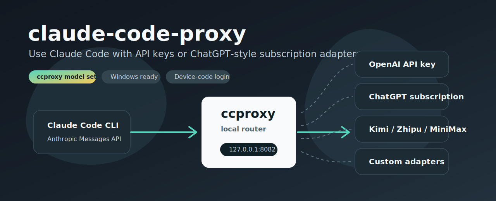
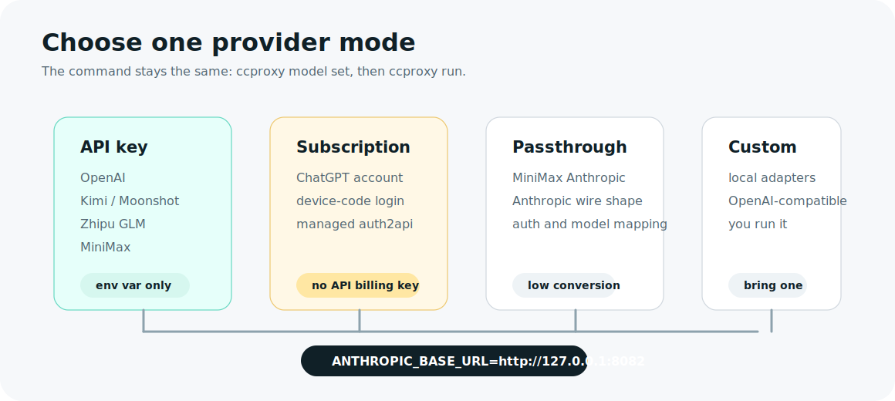

# claude-code-proxy

[English](README.md) | [简体中文](README.zh-CN.md)

One command to use Claude Code with OpenAI API keys, ChatGPT subscription login,
DeepSeek, Kimi, Zhipu GLM, MiniMax, and local adapters.



`ccproxy` is a provider switcher for Claude Code. Install it once, choose a
provider/model with `ccproxy model set`, then run Claude Code through
`ccproxy run`.

## Quick Start

### Windows PowerShell

```powershell
git clone https://github.com/shuaishuaiZhu-ai/claude-code-proxy.git
cd claude-code-proxy
powershell -ExecutionPolicy Bypass -File .\scripts\install.ps1
ccproxy model set
ccproxy run -- -p "reply ccproxy-ok"
```

### macOS / Linux / WSL

```sh
git clone https://github.com/shuaishuaiZhu-ai/claude-code-proxy.git
cd claude-code-proxy
sh scripts/install.sh
ccproxy model set
ccproxy run -- -p "reply ccproxy-ok"
```

Run `ccproxy model set` again whenever you want to switch provider or model.

## What It Supports



| You have | Choose this provider | Mode | Example models |
| --- | --- | --- | --- |
| OpenAI API key | `openai-key` | API key | `gpt-4.1`, `gpt-4.1-mini` |
| ChatGPT subscription | `chatgpt-subscription` | subscription login | `ChatGPT5.5`, `ChatGPT5.4` |
| DeepSeek API key | `deepseek` | API key | `deepseek-v4-pro`, `deepseek-v4-flash` |
| DeepSeek subscription adapter | `deepseek-subscription` | local adapter | adapter model names |
| Kimi / Moonshot API key | `kimi` | API key | `moonshot-v1-128k` |
| Kimi subscription adapter | `kimi-subscription` | local adapter | adapter model names |
| Zhipu GLM API key | `zhipu` | API key | `glm-4-plus`, `glm-4-air` |
| Zhipu subscription adapter | `zhipu-subscription` | local adapter | adapter model names |
| MiniMax China API key | `minimax-cn` | API key | `MiniMax-M2.7` |
| MiniMax Global API key | `minimax-global` | API key | `MiniMax-M2.7` |
| MiniMax Token Plan | `minimax-subscription` | subscription key | `MiniMax-M2.7` |
| Your own adapter | `custom` | local adapter | whatever it exposes |

For MiniMax, the default recommendation is the OpenAI-compatible endpoint. The
Anthropic-compatible MiniMax profiles still exist for advanced users, but they
are hidden from the normal `ccproxy model set` menu to keep setup simple.

## API Key Setup

When an API key is missing, `ccproxy model set` prints the correct key page and
waits for you to paste the key. It does not open the browser automatically.

Key pages:

| Provider | API key page |
| --- | --- |
| OpenAI | https://platform.openai.com/api-keys |
| DeepSeek | https://platform.deepseek.com/api_keys |
| Kimi / Moonshot | https://platform.kimi.com/console/api-keys |
| Zhipu GLM | https://open.bigmodel.cn/usercenter/proj-mgmt/apikeys |
| MiniMax China | https://platform.minimaxi.com/user-center/basic-information/interface-key |
| MiniMax Global | https://platform.minimax.io/user-center/basic-information/interface-key |

Example:

```sh
ccproxy model set --provider deepseek --model deepseek-v4-pro
ccproxy run -- -p "reply ccproxy-ok"
```

Pasted API keys are saved under `~/.ccproxy/secrets.toml`. Environment
variables still work and take priority over saved keys.

## Subscription Setup

ChatGPT subscription mode is managed by `ccproxy`:

```sh
ccproxy model set --provider chatgpt-subscription --model ChatGPT5.5
ccproxy run -- -p "reply ccproxy-ok"
```

The default login is device-code based. Open the printed URL, enter the one-time
code, then return to the terminal.

MiniMax subscription uses the MiniMax Token Plan key through the recommended
OpenAI-compatible endpoint:

```sh
ccproxy model set --provider minimax-subscription --model MiniMax-M2.7
ccproxy run -- -p "reply ccproxy-ok"
```

DeepSeek, Kimi, and Zhipu subscription profiles are local-adapter profiles. Use
them when you already run a compatible local subscription adapter, or use the
API-key provider for the same platform.

## Install And Uninstall

Windows:

```powershell
powershell -ExecutionPolicy Bypass -File .\scripts\install.ps1
powershell -ExecutionPolicy Bypass -File .\scripts\uninstall.ps1
```

macOS / Linux / WSL:

```sh
sh scripts/install.sh
sh scripts/uninstall.sh
```

The uninstall script removes the `claude-code-proxy` package and `~/.ccproxy`
state. It does not uninstall Python, pip, or Claude Code.

## Common Commands

```sh
ccproxy model set
ccproxy model current
ccproxy run -- -p "reply ccproxy-ok"
ccproxy doctor
ccproxy test --profile custom --claude
```

## Troubleshooting

| Symptom | Fix |
| --- | --- |
| Claude Code says `Not logged in` | Run through `ccproxy run`, not plain `claude`. |
| `/skills` shows no skills | Update `ccproxy` and restart Claude through `ccproxy run`; normal runs keep Claude's plugin and skill loading enabled. Use `--bare` only for minimal smoke tests. |
| Tool calls fail with `Invalid tool parameters` | Update `ccproxy`; current builds validate tool-call inputs before forwarding them to Claude Code. |
| API key setup exits early | Update `ccproxy`; current builds ask you to paste and save the key. |
| Browser consent page spins | Stop that run and use default ChatGPT device-code login without `--browser-login`. |
| MiniMax menu shows too many protocol choices | Update `ccproxy`; the normal menu hides advanced Anthropic-compatible profiles. |
| Subscription adapter is unreachable | Start the provider's local adapter, or switch to the API-key provider. |

## Links

- Provider details: [docs/providers.md](docs/providers.md)
- Architecture notes: [docs/architecture.md](docs/architecture.md)
- Example config: [examples/ccproxy.example.toml](examples/ccproxy.example.toml)
- Contributing: [CONTRIBUTING.md](CONTRIBUTING.md)

## License

MIT. See [LICENSE](LICENSE).
