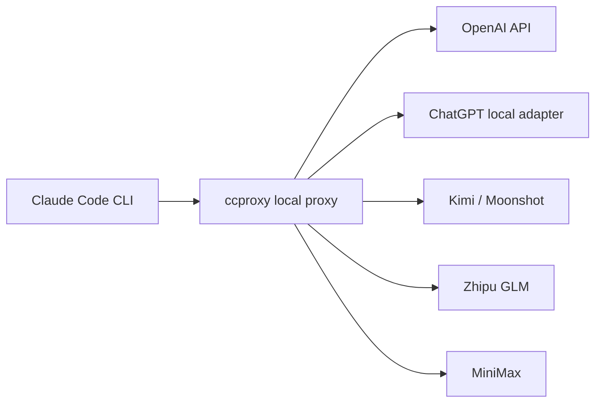

# claude-code-proxy

[English](README.md) | [简体中文](README.zh-CN.md)


`claude-code-proxy` lets Claude Code CLI use OpenAI-compatible or
Anthropic-compatible providers through one local command: `ccproxy`.

The normal workflow is command-first:

```cmd
ccproxy model set
ccproxy run -- -p "reply ccproxy-ok"
```

`ccproxy model set` asks you to choose a provider, then asks you to choose a
model. You can pick a configured model or type any upstream model name, such as
`ChatGPT5.5`, `ChatGPT5.4`, or a model exposed by your own adapter.



## Install

Requires Python 3.11+ and Claude Code CLI.

From GitHub:

```sh
python -m pip install git+https://github.com/shuaishuaiZhu-ai/claude-code-proxy.git
```

From a cloned checkout:

```sh
python -m pip install -e .
```

Check the command:

```sh
ccproxy --version
```

If `ccproxy` is not on `PATH`, use the module form:

```sh
python -m ccproxy --version
python -m ccproxy model set
```

## Windows Quick Start

PowerShell:

```powershell
$env:OPENAI_API_KEY="your-openai-api-key"
ccproxy model set
ccproxy model current
ccproxy run -- -p "reply ccproxy-ok"
```

CMD:

```cmd
set OPENAI_API_KEY=your-openai-api-key
ccproxy model set
ccproxy model current
ccproxy run -- -p "reply ccproxy-ok"
```

If PowerShell blocks `claude.ps1`, `ccproxy run` automatically prefers the npm
`claude.cmd` shim on Windows.

## ChatGPT Subscription Adapter

`chatgpt-subscription` means "route Claude Code to a local adapter that you
run". It does not log in to ChatGPT, read browser cookies, or turn a ChatGPT
Plus/Pro/Team subscription into an OpenAI API key.

Run your adapter first. By default, `ccproxy` expects:

```text
http://127.0.0.1:8000/v1/chat/completions
```

Then choose provider and model:

```cmd
set CHATGPT_ADAPTER_API_KEY=ccproxy
ccproxy model set
ccproxy run -- -p "reply ccproxy-ok"
```

When prompted, choose `chatgpt-subscription`, then type the model name your
adapter understands, for example `ChatGPT5.5`.

Non-interactive form:

```cmd
ccproxy model set --provider chatgpt-subscription --model ChatGPT5.5
ccproxy run -- -p "reply ccproxy-ok"
```

If the adapter is not running, `ccproxy run` stops before launching Claude Code
and prints `upstream adapter is not reachable`.

## macOS / WSL / Linux

```sh
export OPENAI_API_KEY="your-openai-api-key"
ccproxy model set
ccproxy run -- -p "reply ccproxy-ok"
```

For WSL, keep Claude Code, `ccproxy`, and any local adapter in the same
environment when possible. If your adapter runs on Windows and `ccproxy` runs
inside WSL, edit the profile `base_url` to an address reachable from WSL.

## Provider Profiles

| Mode | Profile | Key env | Notes |
| --- | --- | --- | --- |
| OpenAI API key | `openai-key` | `OPENAI_API_KEY` | Direct OpenAI Chat Completions |
| ChatGPT subscription adapter | `chatgpt-subscription` | `CHATGPT_ADAPTER_API_KEY` | Local OpenAI-compatible adapter required |
| Kimi / Moonshot API | `kimi` | `KIMI_API_KEY` | OpenAI-compatible |
| Zhipu GLM API | `zhipu` | `ZHIPU_API_KEY` | OpenAI-compatible |
| MiniMax CN | `minimax-cn` | `MINIMAX_API_KEY` | OpenAI-compatible |
| MiniMax Global | `minimax-global` | `MINIMAX_API_KEY` | OpenAI-compatible |
| MiniMax Anthropic CN | `minimax-cn-anthropic` | `MINIMAX_API_KEY` | Anthropic-compatible passthrough |
| MiniMax Anthropic Global | `minimax-global-anthropic` | `MINIMAX_API_KEY` | Anthropic-compatible passthrough |
| Custom adapter | `custom` | `CCPROXY_CUSTOM_API_KEY` | Local OpenAI-compatible adapter |

## Model Commands

Interactive:

```sh
ccproxy model set
```

Non-interactive:

```sh
ccproxy model set --provider chatgpt-subscription --model ChatGPT5.5
ccproxy model current
ccproxy model clear
```

One-off override without saving:

```sh
ccproxy run --upstream-model ChatGPT5.4 -- -p "reply ccproxy-ok"
```

State files:

- `~/.ccproxy/active.toml`: active provider profile
- `~/.ccproxy/models.toml`: active upstream model per provider

Neither file stores API keys.

## Claude Code Environment

When `ccproxy run` starts Claude Code, it sets these child-process variables:

```text
ANTHROPIC_BASE_URL=http://127.0.0.1:8082
ANTHROPIC_API_KEY=ccproxy
ANTHROPIC_AUTH_TOKEN=ccproxy
```

This prevents an existing real Anthropic key from leaking into a proxy run.

Two-terminal mode is also supported:

```sh
ccproxy serve --profile openai-key
```

Then run Claude Code with the same endpoint:

```sh
ANTHROPIC_BASE_URL=http://127.0.0.1:8082 ANTHROPIC_API_KEY=ccproxy ANTHROPIC_AUTH_TOKEN=ccproxy claude --bare
```

## Smoke Tests

Local translator test:

```sh
ccproxy test
```

Real Claude Code smoke test:

```sh
ccproxy test --profile custom --claude
```

The real Claude smoke test launches Claude Code and sends `reply ccproxy-ok`.
It requires a real provider or a running local adapter for the chosen profile.

For a local fake adapter from a cloned checkout:

```cmd
python scripts\mock_openai_provider.py --port 8000
ccproxy model set --provider custom --model custom-big
ccproxy test --profile custom --claude
```

Expected output:

```text
ccproxy-ok
```

## Troubleshooting

If `ccproxy run -- -p "reply ccproxy-ok"` prints no model answer, check the
active provider first:

```sh
ccproxy model current
```

For `chatgpt-subscription` and `custom`, the local adapter must already be
running. The default adapter address is `http://127.0.0.1:8000/v1`. A plain
`claude` command is not the same as `ccproxy run`; it starts normal Claude Code
auth and may show `Not logged in`.

## Config

Create a user config:

```sh
ccproxy init --profile openai-key
```

Example profile:

```toml
default_profile = "openai-key"

[server]
host = "127.0.0.1"
port = 8082

[profiles.openai-key]
type = "openai-compatible"
base_url = "https://api.openai.com/v1"
api_key_env = "OPENAI_API_KEY"

[profiles.openai-key.models]
big = "gpt-4.1"
middle = "gpt-4.1-mini"
small = "gpt-4.1-nano"
```

Profile types:

- `openai-compatible`: translate Anthropic Messages to OpenAI Chat Completions.
- `anthropic-compatible`: forward Anthropic Messages with auth/model mapping.
- `external-adapter`: OpenAI-compatible wire shape for local subscription
  adapters.

See [docs/providers.md](docs/providers.md) and
[examples/ccproxy.example.toml](examples/ccproxy.example.toml).

## Development

```sh
python -m pip install -e .
python -m unittest discover -s tests
python -m compileall -q src tests scripts
```

Optional FastAPI mode:

```sh
python -m pip install ".[server]"
ccproxy serve --fastapi
```

## License

MIT. See [LICENSE](LICENSE).

Third-party names, platform marks, and documentation imagery belong to their
respective owners. This project is independent and is not affiliated with
OpenAI, Anthropic, MiniMax, Moonshot AI, Zhipu AI, Microsoft, Apple, or Linux
distributors.
