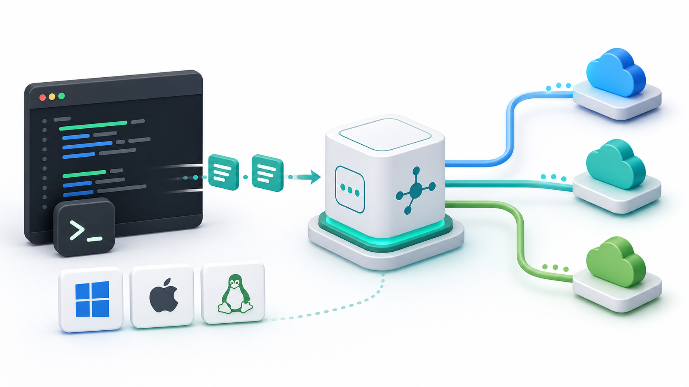
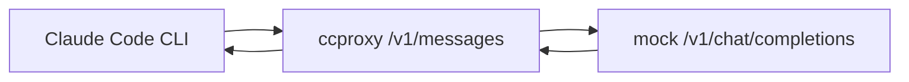

# claude-code-proxy



`claude-code-proxy` is a local Claude Code proxy. It exposes an
Anthropic-compatible `/v1/messages` endpoint for Claude Code CLI, then routes
the request to OpenAI-compatible or Anthropic-compatible model providers.

The goal is simple: keep Claude Code as your coding interface while choosing the
model backend through a local profile.

## What Works

| Mode | Profile | Upstream shape | Status |
| --- | --- | --- | --- |
| OpenAI API key | `openai-key` | OpenAI Chat Completions | Built in |
| ChatGPT subscription | `chatgpt-subscription` | Local OpenAI-compatible adapter | Built in profile, adapter required |
| Kimi / Moonshot API | `kimi` | OpenAI-compatible | Built in |
| Zhipu GLM API | `zhipu` | OpenAI-compatible | Built in |
| MiniMax CN | `minimax-cn` | OpenAI-compatible | Built in |
| MiniMax Global | `minimax-global` | OpenAI-compatible | Built in |
| MiniMax Anthropic CN | `minimax-cn-anthropic` | Anthropic-compatible | Built in |
| MiniMax Anthropic Global | `minimax-global-anthropic` | Anthropic-compatible | Built in |
| Custom subscription adapter | `custom` | Local OpenAI-compatible adapter | Built in profile, adapter required |

`ccproxy` does not log in to web accounts, scrape browser cookies, or manage
ChatGPT/Kimi/GLM/MiniMax web sessions. Subscription-style accounts must be
handled by a local adapter that you run and control. That adapter must expose an
OpenAI-compatible `/v1/chat/completions` endpoint.

## Quick Start

### 1. Install

From GitHub:

```bash
python -m pip install git+https://github.com/shuaishuaiZhu-ai/claude-code-proxy.git
```

For local development from a cloned checkout:

```bash
python -m pip install -e .
```

The default install has no runtime third-party dependencies. The standard
library server is used by default. Optional FastAPI mode is available with:

```bash
python -m pip install "git+https://github.com/shuaishuaiZhu-ai/claude-code-proxy.git"
python -m pip install fastapi uvicorn
```

### 2. Create Config

OpenAI API key mode:

```bash
ccproxy init --profile openai-key
```

MiniMax CN mode:

```bash
ccproxy init --profile minimax-cn
```

This writes `~/.ccproxy/config.toml`. To keep config local to a project:

```bash
ccproxy init --profile openai-key --config ./ccproxy.toml
```

### 3. Set Provider Key

PowerShell:

```powershell
$env:OPENAI_API_KEY="your-openai-api-key"
```

Bash / zsh:

```bash
export OPENAI_API_KEY="your-openai-api-key"
```

Common environment variables:

- `OPENAI_API_KEY`
- `CHATGPT_ADAPTER_API_KEY`
- `KIMI_API_KEY`
- `ZHIPU_API_KEY`
- `MINIMAX_API_KEY`
- `CCPROXY_CUSTOM_API_KEY`

### 4. Run Claude Code Through The Proxy

One-command mode:

```bash
ccproxy run --profile openai-key -- claude -p "reply ccproxy-ok"
```

Two-terminal mode:

```bash
ccproxy serve --profile openai-key
```

Then:

```bash
ANTHROPIC_BASE_URL=http://127.0.0.1:8082 ANTHROPIC_API_KEY=ccproxy claude
```

Windows PowerShell may block `claude.ps1`. Use the npm `.cmd` shim:

```powershell
cmd.exe /d /s /c claude --version
```

`ccproxy run` automatically prefers `claude.cmd` on Windows.

## Test Without A Real API Key

Start the bundled mock OpenAI-compatible provider:

```bash
python scripts/mock_openai_provider.py --port 8000
```

In another terminal:

```bash
ccproxy init --profile custom --config ./mock.toml
ccproxy run --config ./mock.toml --profile custom -- claude --model sonnet -p "reply ccproxy-ok"
```

Expected output:

```text
ccproxy-ok
```

This verifies the local path:



## Provider Notes

### OpenAI API Key

Use `openai-key` when you have an OpenAI platform API key:

```bash
ccproxy init --profile openai-key
ccproxy doctor --profile openai-key
ccproxy test --profile openai-key
```

`ccproxy test` is local by default. To call the real provider:

```bash
ccproxy test --profile openai-key --real
```

### ChatGPT Subscription

Use `chatgpt-subscription` only when you already have a local adapter for your
ChatGPT subscription:

```bash
ccproxy init --profile chatgpt-subscription
```

The default adapter URL is:

```text
http://127.0.0.1:8000/v1/chat/completions
```

ChatGPT Plus/Pro/Team subscriptions and OpenAI API billing are separate product
surfaces. `ccproxy` does not turn a ChatGPT subscription into an OpenAI API key.

On Windows, the helper script wires Claude Code to a local ChatGPT subscription
adapter:

```powershell
powershell -ExecutionPolicy Bypass -File .\scripts\run_chatgpt_subscription.ps1 -AdapterBaseUrl "http://127.0.0.1:8000/v1"
```

The helper adds Claude Code's `--bare` flag by default so Claude Code uses the
local proxy instead of opening the login-method selector. Pass `-NoBare` only if
you explicitly want the normal Claude Code auth/keychain flow.

Smoke test through the same script:

```powershell
powershell -ExecutionPolicy Bypass -File .\scripts\run_chatgpt_subscription.ps1 -Prompt "reply ccproxy-ok"
```

Windows `.cmd` shortcuts:

```cmd
scripts\chatgpt-doctor.cmd
scripts\chatgpt-smoke.cmd
scripts\chatgpt-run.cmd
```

For a local fake adapter test only:

```cmd
scripts\mock-adapter.cmd
```

### MiniMax

OpenAI-compatible endpoints:

- CN: `https://api.minimaxi.com/v1`
- Global: `https://api.minimax.io/v1`

Anthropic-compatible endpoints:

- CN: `https://api.minimaxi.com/anthropic`
- Global: `https://api.minimax.io/anthropic`

Built-in models:

- `MiniMax-M2.7`
- `MiniMax-M2.7-highspeed`
- `MiniMax-M2.5`

## Commands

```bash
ccproxy init --profile openai-key
ccproxy serve --profile openai-key
ccproxy run --profile openai-key -- claude -p "reply ccproxy-ok"
ccproxy doctor --profile openai-key
ccproxy test --profile openai-key
ccproxy test --profile openai-key --real
```

## Config Shape

```toml
default_profile = "openai-key"

[server]
host = "127.0.0.1"
port = 8082

[profiles.openai-key]
type = "openai-compatible"
base_url = "https://api.openai.com/v1"
api_key_env = "OPENAI_API_KEY"

[profiles.openai-key.models]
big = "gpt-4.1"
middle = "gpt-4.1-mini"
small = "gpt-4.1-nano"
```

Profile types:

- `openai-compatible`: translate Anthropic Messages to Chat Completions.
- `anthropic-compatible`: forward Anthropic Messages with model/auth mapping.
- `external-adapter`: same wire shape as OpenAI-compatible, intended for local
  subscription adapters.

## Development

```bash
python -m pip install -e .
python -m unittest discover -s tests
python -m compileall -q src tests scripts
```

The repository intentionally keeps the runtime core dependency-light:

- `argparse`, `http.server`, and `urllib` for the default path.
- Optional `fastapi`/`uvicorn` only for `ccproxy serve --fastapi`.

## Limitations

- Streaming text is supported; complex streaming tool-call deltas are normalized
  into Anthropic blocks after the OpenAI stream completes.
- Provider model names change over time. Edit `~/.ccproxy/config.toml` if your
  provider uses newer model IDs.
- Real provider tests require the matching environment variable to be set.

## License

MIT. See [LICENSE](LICENSE).

Third-party names and platform marks shown in documentation imagery belong to
their respective owners. This project is independent and is not affiliated with
OpenAI, Anthropic, MiniMax, Moonshot AI, Zhipu AI, Microsoft, Apple, or Linux
distributors.
