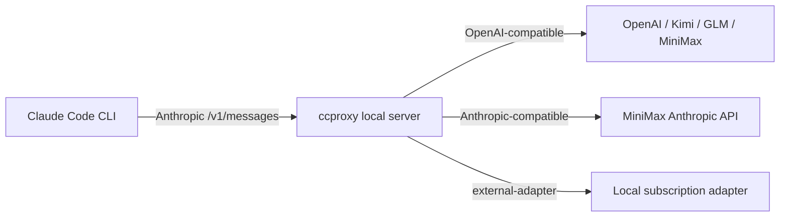

# cc-provider-proxy

`cc-provider-proxy` 是给 Claude Code CLI 使用的本地代理工具，CLI 命令名是
`ccproxy`。它接收 Claude Code 发出的 Anthropic `/v1/messages` 请求，并把请求转到
OpenAI-compatible 或 Anthropic-compatible 模型服务。

内置 profile：

- OpenAI API key 模式：`openai-key`
- ChatGPT 订阅模式：`chatgpt-subscription`，通过本地 external adapter 接入
- Kimi / Moonshot API
- 智谱 GLM API
- MiniMax 中国区和国际区
- 本地 `custom` external adapter

核心不会做网页登录、cookie 抓取或 session 自动化。ChatGPT 订阅、Kimi 订阅、GLM 订阅、
MiniMax 订阅如果要接入，需要由你自己的 adapter 暴露 OpenAI-compatible endpoint。

## 架构



## 安装

开发环境直接在仓库根目录运行：

```powershell
$env:PYTHONPATH="src"
python -m ccproxy --version
```

正式安装：

```bash
python -m pip install .
ccproxy --version
```

可选 FastAPI 服务模式需要安装项目依赖；没有安装依赖时，`ccproxy serve` 会使用标准库
HTTP server，仍可跨平台运行。

## 初始化配置

OpenAI API key 模式：

```bash
ccproxy init --profile openai-key
```

ChatGPT 订阅模式：

```bash
ccproxy init --profile chatgpt-subscription
```

默认会写入：

```text
~/.ccproxy/config.toml
```

也可以写到当前目录：

```bash
ccproxy init --profile minimax-cn --config ./ccproxy.toml
```

配置只保存环境变量名，不保存真实 key。

```toml
default_profile = "openai-key"

[server]
host = "127.0.0.1"
port = 8082

[profiles.openai-key]
type = "openai-compatible"
base_url = "https://api.openai.com/v1"
api_key_env = "OPENAI_API_KEY"

[profiles.openai-key.models]
big = "gpt-4.1"
middle = "gpt-4.1-mini"
small = "gpt-4.1-nano"

[profiles.chatgpt-subscription]
type = "external-adapter"
base_url = "http://127.0.0.1:8000/v1"
api_key_env = "CHATGPT_ADAPTER_API_KEY"

[profiles.chatgpt-subscription.models]
big = "chatgpt-big"
middle = "chatgpt-middle"
small = "chatgpt-small"
```

## Provider Key

PowerShell：

```powershell
$env:OPENAI_API_KEY="your-openai-api-key"
$env:CHATGPT_ADAPTER_API_KEY="optional-local-adapter-key"
$env:MINIMAX_API_KEY="your-minimax-key"
```

Bash / zsh：

```bash
export OPENAI_API_KEY="your-openai-api-key"
export CHATGPT_ADAPTER_API_KEY="optional-local-adapter-key"
export MINIMAX_API_KEY="your-minimax-key"
```

常用环境变量：

- `OPENAI_API_KEY`
- `CHATGPT_ADAPTER_API_KEY`
- `KIMI_API_KEY`
- `ZHIPU_API_KEY`
- `MINIMAX_API_KEY`
- `CCPROXY_CUSTOM_API_KEY`

## 使用 Claude Code

启动本地代理：

```bash
ccproxy serve --profile openai-key
```

另一个终端里让 Claude Code 指向本地代理：

```bash
ANTHROPIC_BASE_URL=http://127.0.0.1:8082 ANTHROPIC_API_KEY=ccproxy claude
```

Windows PowerShell 下不要直接依赖 `claude.ps1`。如果执行策略拦截，使用：

```powershell
cmd.exe /d /s /c claude
```

也可以让 `ccproxy` 自动启动代理并运行 Claude Code：

```bash
ccproxy run --profile openai-key -- claude -p "reply ccproxy-ok"
```

Windows 上默认会优先查找 `claude.cmd`。

## OpenAI Key 和 ChatGPT 订阅

OpenAI key 模式直接使用 OpenAI API：

```bash
ccproxy init --profile openai-key
ccproxy run --profile openai-key -- claude -p "reply ccproxy-ok"
```

ChatGPT 订阅模式使用本地 adapter。你的 adapter 需要暴露 OpenAI-compatible endpoint，
例如 `http://127.0.0.1:8000/v1/chat/completions`。

```bash
ccproxy init --profile chatgpt-subscription
ccproxy run --profile chatgpt-subscription -- claude -p "reply ccproxy-ok"
```

ChatGPT Plus/Pro/Team 订阅和 OpenAI API key/账单不是同一个产品入口。`ccproxy`
不会直接登录 ChatGPT 网页账号，也不会保存 cookie；它只负责把 Claude Code 请求转给
你本地 adapter。

## MiniMax

MiniMax OpenAI-compatible：

- 中国区：`https://api.minimaxi.com/v1`
- 国际区：`https://api.minimax.io/v1`

MiniMax Anthropic-compatible：

- 中国区：`https://api.minimaxi.com/anthropic`
- 国际区：`https://api.minimax.io/anthropic`

内置 profile：

```bash
ccproxy init --profile minimax-cn
ccproxy init --profile minimax-global
ccproxy init --profile minimax-cn-anthropic
ccproxy init --profile minimax-global-anthropic
```

Anthropic-compatible MiniMax profile 不做二次 OpenAI 协议转换，只负责本地启动、鉴权、
模型映射和转发。

## 诊断和测试

```bash
ccproxy doctor --profile openai-key
ccproxy test --profile openai-key
```

真实 provider smoke test 只有在设置了对应 API key 时才运行：

```bash
ccproxy test --profile openai-key --real
```

Windows 本机验证 Claude Code：

```powershell
cmd.exe /d /s /c claude --version
```
