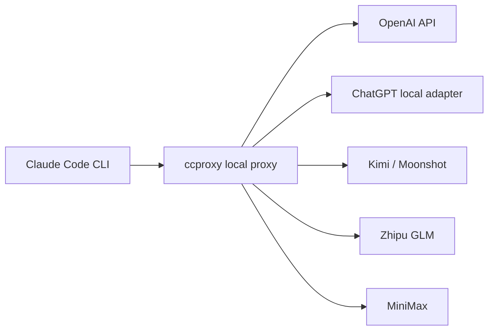

# claude-code-proxy

[English](README.md) | [简体中文](README.zh-CN.md)


`claude-code-proxy` 让 Claude Code CLI 通过本地 `ccproxy` 命令使用
OpenAI-compatible 或 Anthropic-compatible 的模型供应商。

正常使用路径是命令优先：

```cmd
ccproxy model set
ccproxy run -- -p "reply ccproxy-ok"
```

`ccproxy model set` 会先让你选择 provider，再让你选择模型。模型可以从配置
列表里选，也可以直接输入任意上游模型名，比如 `ChatGPT5.5`、`ChatGPT5.4`
或你的本地 adapter 暴露出来的模型名。



## 安装

需要 Python 3.11+ 和 Claude Code CLI。

从 GitHub 安装：

```sh
python -m pip install git+https://github.com/shuaishuaiZhu-ai/claude-code-proxy.git
```

本地 clone 后开发安装：

```sh
python -m pip install -e .
```

确认命令可用：

```sh
ccproxy --version
```

如果 `ccproxy` 不在 `PATH` 里，可以使用模块形式：

```sh
python -m ccproxy --version
python -m ccproxy model set
```

## Windows 快速开始

PowerShell：

```powershell
$env:OPENAI_API_KEY="your-openai-api-key"
ccproxy model set
ccproxy model current
ccproxy run -- -p "reply ccproxy-ok"
```

CMD：

```cmd
set OPENAI_API_KEY=your-openai-api-key
ccproxy model set
ccproxy model current
ccproxy run -- -p "reply ccproxy-ok"
```

如果 PowerShell 阻止 `claude.ps1`，`ccproxy run` 在 Windows 上会自动优先使用
npm 的 `claude.cmd` 入口。

## ChatGPT 订阅 adapter

`chatgpt-subscription` 的含义是“把 Claude Code 请求转发到你自己运行的本地
adapter”。它不会登录 ChatGPT，不会读取浏览器 cookie，也不会把 ChatGPT
Plus/Pro/Team 订阅变成 OpenAI API key。

先启动你的 adapter。默认地址是：

```text
http://127.0.0.1:8000/v1/chat/completions
```

然后选择 provider 和模型：

```cmd
set CHATGPT_ADAPTER_API_KEY=ccproxy
ccproxy model set
ccproxy run -- -p "reply ccproxy-ok"
```

提示选择 provider 时选 `chatgpt-subscription`，提示选择模型时可以直接输入
adapter 支持的模型名，比如 `ChatGPT5.5`。

非交互写法：

```cmd
ccproxy model set --provider chatgpt-subscription --model ChatGPT5.5
ccproxy run -- -p "reply ccproxy-ok"
```

## macOS / WSL / Linux

```sh
export OPENAI_API_KEY="your-openai-api-key"
ccproxy model set
ccproxy run -- -p "reply ccproxy-ok"
```

WSL 下建议让 Claude Code、`ccproxy` 和本地 adapter 都运行在同一个环境里。
如果 adapter 在 Windows 上、`ccproxy` 在 WSL 里，需要把 profile 的
`base_url` 改成 WSL 能访问到的地址。

## Provider Profiles

| 模式 | Profile | Key 环境变量 | 说明 |
| --- | --- | --- | --- |
| OpenAI API key | `openai-key` | `OPENAI_API_KEY` | 直连 OpenAI Chat Completions |
| ChatGPT subscription adapter | `chatgpt-subscription` | `CHATGPT_ADAPTER_API_KEY` | 需要本地 OpenAI-compatible adapter |
| Kimi / Moonshot API | `kimi` | `KIMI_API_KEY` | OpenAI-compatible |
| 智谱 GLM API | `zhipu` | `ZHIPU_API_KEY` | OpenAI-compatible |
| MiniMax 中国区 | `minimax-cn` | `MINIMAX_API_KEY` | OpenAI-compatible |
| MiniMax 国际区 | `minimax-global` | `MINIMAX_API_KEY` | OpenAI-compatible |
| MiniMax Anthropic 中国区 | `minimax-cn-anthropic` | `MINIMAX_API_KEY` | Anthropic-compatible passthrough |
| MiniMax Anthropic 国际区 | `minimax-global-anthropic` | `MINIMAX_API_KEY` | Anthropic-compatible passthrough |
| 自定义 adapter | `custom` | `CCPROXY_CUSTOM_API_KEY` | 本地 OpenAI-compatible adapter |

## 模型命令

交互式：

```sh
ccproxy model set
```

非交互式：

```sh
ccproxy model set --provider chatgpt-subscription --model ChatGPT5.5
ccproxy model current
ccproxy model clear
```

只覆盖本次运行，不保存：

```sh
ccproxy run --upstream-model ChatGPT5.4 -- -p "reply ccproxy-ok"
```

状态文件：

- `~/.ccproxy/active.toml`：当前 provider profile
- `~/.ccproxy/models.toml`：每个 provider 当前选择的上游模型

这两个文件都不会保存 API key。

## Claude Code 环境变量

`ccproxy run` 启动 Claude Code 时，会给子进程设置：

```text
ANTHROPIC_BASE_URL=http://127.0.0.1:8082
ANTHROPIC_API_KEY=ccproxy
ANTHROPIC_AUTH_TOKEN=ccproxy
```

这样可以避免用户已有的真实 Anthropic key 被带入 proxy 运行。

也支持双终端模式：

```sh
ccproxy serve --profile openai-key
```

另一个终端运行：

```sh
ANTHROPIC_BASE_URL=http://127.0.0.1:8082 ANTHROPIC_API_KEY=ccproxy ANTHROPIC_AUTH_TOKEN=ccproxy claude --bare
```

## Smoke Test

本地 translator 测试：

```sh
ccproxy test
```

真实 Claude Code smoke test：

```sh
ccproxy test --profile custom --claude
```

真实 Claude smoke test 会启动 Claude Code，并发送 `reply ccproxy-ok`。它需要
你选择的 profile 有真实 provider，或者已经启动本地 adapter。

如果是 clone 仓库后用本地假 adapter 测试：

```cmd
python scripts\mock_openai_provider.py --port 8000
ccproxy model set --provider custom --model custom-big
ccproxy test --profile custom --claude
```

期望输出：

```text
ccproxy-ok
```

## 配置

创建用户配置：

```sh
ccproxy init --profile openai-key
```

配置示例：

```toml
default_profile = "openai-key"

[server]
host = "127.0.0.1"
port = 8082

[profiles.openai-key]
type = "openai-compatible"
base_url = "https://api.openai.com/v1"
api_key_env = "OPENAI_API_KEY"

[profiles.openai-key.models]
big = "gpt-4.1"
middle = "gpt-4.1-mini"
small = "gpt-4.1-nano"
```

Profile 类型：

- `openai-compatible`：把 Anthropic Messages 请求转换成 OpenAI Chat Completions。
- `anthropic-compatible`：按 Anthropic 形态转发，只做鉴权和模型映射。
- `external-adapter`：面向本地订阅 adapter 的 OpenAI-compatible wire shape。

更多内容见 [docs/providers.md](docs/providers.md) 和
[examples/ccproxy.example.toml](examples/ccproxy.example.toml)。

## 开发

```sh
python -m pip install -e .
python -m unittest discover -s tests
python -m compileall -q src tests scripts
```

可选 FastAPI 模式：

```sh
python -m pip install ".[server]"
ccproxy serve --fastapi
```

## License

MIT. See [LICENSE](LICENSE).
