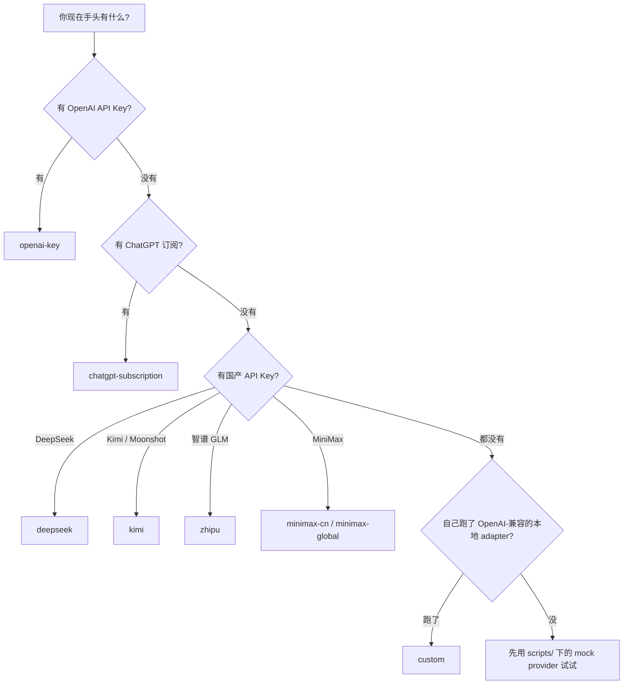
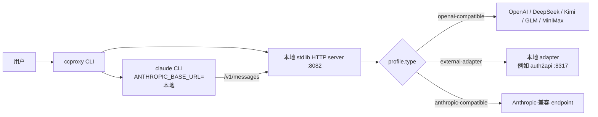

<!--
README 改写说明(详见 docs/architecture-review.md)。
目标: 顶部第一屏就能看出"它能帮你做什么", 30 秒能跑通, 用决策树代替
14 行 provider 表,加 FAQ 和贡献指引。
删了: `ccproxy run -- -p "reply ccproxy-ok"` 重复 6 次的 smoke 命令、
MiniMax 隐藏 Anthropic profile 这种实现细节、首屏堆所有 API key 链接。
加了: hero tagline + badges(基础设施没到位的用 TODO 标出)、mermaid 架构图、
ASCII demo、FAQ、贡献入口、roadmap。和 README.md 结构完全对齐。
中文版可以更口语化(避免机翻腔)。
-->

# claude-code-proxy

**一条 `ccproxy` 命令,让 Claude Code 用你手头任何 provider。**

[English](README.md) · [简体中文](README.zh-CN.md)


`ccproxy` 是一个轻量本地代理。装一次,Claude Code 就能去用 OpenAI、你的
ChatGPT 订阅、DeepSeek、Kimi、智谱 GLM、MiniMax,或你自己写的 adapter。

用法很简单:平时怎么敲 `claude …`,现在改敲 `ccproxy run …`。Claude Code
的 plugin、skill、MCP 都不会被关。

<!-- TODO 等 PyPI / CI badge 配好后再打开
[](https://pypi.org/project/claude-code-proxy/)
[](https://github.com/shuaishuaiZhu-ai/claude-code-proxy/actions)
-->


---

## 30 秒上手

```sh
git clone https://github.com/shuaishuaiZhu-ai/claude-code-proxy.git
cd claude-code-proxy
sh scripts/install.sh             # Windows: powershell -ExecutionPolicy Bypass -File .\scripts\install.ps1
ccproxy model set                 # 选 provider 和模型,问你要 key 就贴
ccproxy run -- -p "reply ccproxy-ok"
```

终端打印 `ccproxy-ok` 就 OK 了。直接去看 [切换 provider 或模型](#切换-provider-或模型)。

> 🛈 PyPI 发布在 roadmap 上。暂时只能 git clone。

---

## 为什么用 ccproxy

| 不用 ccproxy | 用 ccproxy |
|---|---|
| Claude Code 只能连 Anthropic | 同一个 Claude Code,接任意 provider |
| 切 provider 要改环境变量重启 | `ccproxy model set` 一句话搞定 |
| ChatGPT 订阅在命令行用不了 | 内置 `auth2api` adapter 托管登录 |
| 想拼任意组合得自己写代理 | 14 个 provider 预置 + 一个 `custom` 槽位 |

它不会:

- 把 key 偷走。全程跑在 `127.0.0.1`,源码就 ~90KB 可以审。详见 [SECURITY.md](SECURITY.md)。
- 把 ChatGPT Plus/Pro 订阅变成 OpenAI API Key。订阅模式是用你浏览器的 OAuth 登录。
- 关掉 Claude Code 的 plugin / skill / MCP。普通 `ccproxy run` 全保留。`--bare` 只用于 smoke test。

---

## 选哪个 provider



<details>
<summary>完整 14 个 profile(含订阅 adapter)</summary>

| 你拥有的入口 | 选 | 模式 | 示例模型 |
| --- | --- | --- | --- |
| OpenAI API Key | `openai-key` | API Key | `gpt-4.1`, `gpt-4.1-mini` |
| ChatGPT 订阅 | `chatgpt-subscription` | 托管 adapter | `ChatGPT5.5`, `ChatGPT5.4` |
| DeepSeek API Key | `deepseek` | API Key | `deepseek-v4-pro`, `deepseek-v4-flash` |
| DeepSeek 订阅 adapter | `deepseek-subscription` | 本地 adapter | adapter 暴露的模型 |
| Kimi / Moonshot API Key | `kimi` | API Key | `moonshot-v1-128k` |
| Kimi 订阅 adapter | `kimi-subscription` | 本地 adapter | adapter 暴露的模型 |
| 智谱 GLM API Key | `zhipu` | API Key | `glm-4-plus`, `glm-4-air` |
| 智谱订阅 adapter | `zhipu-subscription` | 本地 adapter | adapter 暴露的模型 |
| MiniMax 中国区 API Key | `minimax-cn` | API Key | `MiniMax-M2.7` |
| MiniMax 国际区 API Key | `minimax-global` | API Key | `MiniMax-M2.7` |
| MiniMax Token Plan | `minimax-subscription` | 订阅 Key | `MiniMax-M2.7` |
| 自己的 adapter | `custom` | 本地 adapter | adapter 暴露的模型 |

MiniMax 还有 Anthropic-compatible 的 profile(`minimax-cn-anthropic` /
`minimax-global-anthropic`),给高级用户准备,默认菜单里不显示。详见
[Wiki](wiki/zh-CN/Providers-And-Models.md)。
</details>

---

## 5 分钟走一遍

### 第一次跑

```sh
$ ccproxy model set
Choose provider:
1.   chatgpt-subscription (external-adapter)
2. * deepseek (openai-compatible)
3.   kimi (openai-compatible)
...
Provider number or name: 2
Choose model for deepseek:
1. big: deepseek-v4-pro
2. middle: deepseek-v4-flash
3. small: deepseek-v4-flash
Or type any custom upstream model name, for example ChatGPT5.5.
Model number, alias, or custom model name: big
active provider: deepseek
active model: deepseek-v4-pro
```

如果还没配 key,ccproxy 会打印对应平台的取 key 地址,然后停下来等你粘贴。
粘贴过的 key 保存在 `~/.ccproxy/secrets.toml`,在 POSIX 系统上权限会收紧
到 `0o600`(Windows 的 ACL 还有已知缺陷,详见
[架构 review §7.2](docs/architecture-review.md#72-secrets-are-plaintext-0o600-is-a-no-op-on-windows-p2-m-independent))。

### 让 Claude Code 走 ccproxy

`--` 后面的参数全部转给 `claude`:

```sh
ccproxy run -- -p "总结一下这个仓库"
ccproxy run -- --model sonnet -p "reply ccproxy-ok"
```

ccproxy 会在 `127.0.0.1:8082` 启动本地代理,把 `ANTHROPIC_BASE_URL` 指过来,
然后等 `claude` 跑完。

### 切换 provider 或模型

随时再跑一次 `ccproxy model set`:

```sh
ccproxy model set                                              # 交互式
ccproxy model set --provider chatgpt-subscription --model ChatGPT5.5
ccproxy model set --provider kimi --model moonshot-v1-128k
ccproxy model current
```

状态记在 `~/.ccproxy/active.toml` 和 `~/.ccproxy/models.toml`。

### 想快速看下能不能跑

```sh
ccproxy doctor
```

打印 Python/平台/当前 profile/key 状态/Claude CLI 位置;选 ChatGPT 订阅
时还会打印托管 adapter 的健康状态。

---

## 安装

### macOS / Linux / WSL

```sh
sh scripts/install.sh                         # 默认
sh scripts/install.sh --with-server           # 顺手装 FastAPI/uvicorn(可选)
sh scripts/install.sh --no-init               # 不写默认配置
```

### Windows PowerShell

```powershell
powershell -ExecutionPolicy Bypass -File .\scripts\install.ps1
powershell -ExecutionPolicy Bypass -File .\scripts\install.ps1 -WithServer
```

两个脚本都会:

1. 检查 Python 3.11+ 和 pip。
2. 没找到 `claude` 命令时给个警告(不会终止)。
3. 用 `pip install -e .` 装当前仓库。
4. 跑 `ccproxy init --skip-model-set` 写一份默认配置。

一般用不到 `--with-server`,代理用标准库的 HTTP server 就够了。
**ChatGPT 订阅模式额外需要 Node.js 20+ 和 git**,选 `chatgpt-subscription`
之前先把它们装好。

### 卸载

```sh
sh scripts/uninstall.sh                       # 一并删 ~/.ccproxy
sh scripts/uninstall.sh --keep-state          # 保留 ~/.ccproxy
```

```powershell
powershell -ExecutionPolicy Bypass -File .\scripts\uninstall.ps1
```

两个脚本都**不**会卸 Python、pip、Node、git 或 Claude Code。

---

## 🚑 排错

先跑 `ccproxy doctor`,再对症状表。

| 现象 | 可能原因 | 处理 |
| --- | --- | --- |
| Claude Code 报 `Not logged in` | 你跑了原生 `claude`,没经过 ccproxy | 用 `ccproxy run -- …`,这样 `ANTHROPIC_BASE_URL` 才会被设上 |
| `/skills` 一片空白 | 加了 `--bare` | 去掉 `--bare`,它只用于 smoke test |
| `Invalid tool parameters` | 装的是旧版 | 升级 ccproxy,新版会在转发前校验 tool call |
| API key 设置直接退出 | 输入空 key | 重新跑 `ccproxy model set`,把 key 粘进去 |
| 浏览器 consent 页一直转 | 浏览器回调被拦了 | 中止这次跑,改用默认 device-code 登录(别加 `--browser-login`) |
| 端口 1455 报 `EADDRINUSE` | 另一个回调 listener 在占用 | 关掉那个进程,再跑 `ccproxy model set` |
| Adapter 连不上 | 本地订阅 adapter 没启动 | 启它,或者改用该平台的 API-key provider |
| PowerShell 拦 `.ps1` | 本地执行策略限制 | 用装好的 `ccproxy` 命令,或者装脚本时加 `-ExecutionPolicy Bypass` |

ChatGPT 订阅专属诊断:

```sh
ccproxy doctor --profile chatgpt-subscription
```

会额外打印 adapter 安装/登录状态、回调端口占用、Cloudflare challenge 提示。

### 端口冲突

代理默认端口 `8082`,ChatGPT 订阅的托管 adapter 跑在 `8317`。要改:

```sh
ccproxy run --port 8090 -- -p "reply ccproxy-ok"
```

### 没 key 也想先试试

```sh
python scripts/mock_openai_provider.py --port 8000
ccproxy model set --provider custom --model custom-big
ccproxy run -- -p "reply ccproxy-ok"
```

---

## ❓ FAQ

**我没 API key 能玩吗?**
能。仓库里的 `scripts/mock_openai_provider.py` 是一个本地假 OpenAI endpoint,
把 `custom` profile 指过去就行。

**我的 key 存哪儿?**
`~/.ccproxy/secrets.toml`,POSIX 上权限 `0o600`。环境变量(`OPENAI_API_KEY`、
`DEEPSEEK_API_KEY` 等)仍然能用,而且优先级比文件高。代理不会在日志里
打印 key。

**ChatGPT Plus 订阅能换出 OpenAI API Key 吗?**
不能。订阅模式走的是**你**浏览器里的 OAuth 登录,不会铸一个 OpenAI Platform
的 API Key。要用 Platform API,请用 `openai-key` + `OPENAI_API_KEY`。

**Claude Code 的 plugin / skill / MCP 会被关掉吗?**
不会。普通 `ccproxy run` 全保留。`--bare` 是最小 smoke test 才用的。

**为什么要做代理,不直接改 `~/.claude/config`?**
Claude Code 说的是 Anthropic Messages 协议,大部分 provider 说的是 OpenAI
Chat Completions。代理负责双向翻译,包括流式、tool call、tool schema、
assistant content block。详见 [docs/architecture.md](docs/architecture.md)。

**支持本地模型 / Ollama 吗?**
间接支持。任何 OpenAI 兼容的本地 server 都能挂到 `custom` profile(默认
`http://127.0.0.1:8000/v1`)。

**为啥仓库叫 `claude-code-proxy`,命令却叫 `ccproxy`?**
仓库名说清角色,命令名为了日常敲方便。

**怎么加新 provider?**
一次性的,在 `~/.ccproxy/config.toml` 加一段 `[profiles.your-name]` —— 模板
在 [`examples/ccproxy.example.toml`](examples/ccproxy.example.toml)。想做成
内置,改 `src/ccproxy/presets.py` 然后开 PR(测试看
`tests/test_provider_setup.py`)。

---

## 🛠 一张图看架构



流式翻译、tool call 转换、状态文件细节看
[docs/architecture.md](docs/architecture.md) 和
[Wiki 架构页](wiki/zh-CN/Architecture.md)。

---

## 贡献

代码很小(~90KB Python,零运行时依赖)。挑个入口:

| 你想… | 改这里 |
| --- | --- |
| 加一个内置 provider | `src/ccproxy/presets.py` + `src/ccproxy/provider_setup.py` + 给 `tests/test_provider_setup.py` 加用例 |
| 修翻译 bug | `src/ccproxy/translator.py` + 给 `tests/test_translator.py` 加 case |
| 优化 ChatGPT 订阅流程 | `src/ccproxy/adapter.py` |
| 让 CLI 更顺手 | `src/ccproxy/cli.py` |

开 PR 前:

```sh
python -m pip install -e .
python -m unittest discover -s tests
python -m compileall -q src tests scripts
```

`docs/architecture-review.md` 列了我最希望被认领的技术债,挑任何 P1/P2 都
欢迎。完整 checklist 看 [CONTRIBUTING.md](CONTRIBUTING.md)。

---

## Roadmap

项目目前是 **0.1.0**,接口够日常用,还没稳到能被别的库依赖。

接下来计划做的:

- [ ] 发 PyPI(让安装变成 `pip install claude-code-proxy`)
- [ ] CI 覆盖 Windows + macOS + Linux 矩阵
- [ ] `auth2api` pin 到固定 tag(供应链加固)
- [ ] `print()` 换成 `logging`(支持 `--debug` / `--quiet`)
- [ ] `ccproxy doctor --fix`
- [ ] 可选的 `keyring` 后端存 secret

完整 punch list 和依赖关系图见
[`docs/architecture-review.md`](docs/architecture-review.md)。

---

## 相关链接

- 📚 Wiki: [首页](wiki/zh-CN/Home.md) · [快速开始](wiki/zh-CN/Quick-Start.md) · [供应商与模型](wiki/zh-CN/Providers-And-Models.md) · [架构](wiki/zh-CN/Architecture.md) · [订阅登录](wiki/zh-CN/Subscription-Login.md) · [故障排查](wiki/zh-CN/Troubleshooting.md) · [测试](wiki/zh-CN/Testing.md)
- 🧠 架构说明: [docs/architecture.md](docs/architecture.md)
- 📋 架构 review: [docs/architecture-review.md](docs/architecture-review.md)
- 🔌 Provider 细节: [docs/providers.md](docs/providers.md)
- ⚙ 配置示例: [examples/ccproxy.example.toml](examples/ccproxy.example.toml)
- 🤝 贡献说明: [CONTRIBUTING.md](CONTRIBUTING.md)
- 🔐 安全声明: [SECURITY.md](SECURITY.md)

## License

MIT. 详见 [LICENSE](LICENSE)。
