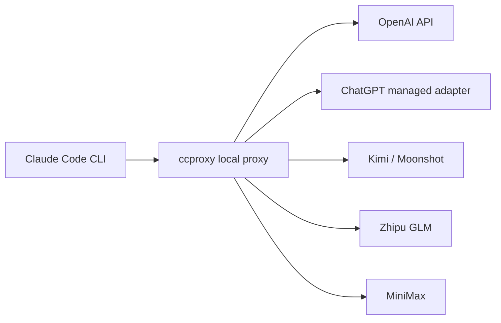

# claude-code-proxy

[English](README.md) | [简体中文](README.zh-CN.md)


`claude-code-proxy` 让 Claude Code CLI 通过本地 `ccproxy` 命令使用
OpenAI-compatible 或 Anthropic-compatible 的模型供应商。

正常路径是命令优先：

```cmd
ccproxy init
ccproxy model set
ccproxy run -- -p "reply ccproxy-ok"
```

`ccproxy init` 会写入配置、执行一次模型选择，并为所选 provider 做必要设置。
之后可以用 `ccproxy model set` 随时切换 provider 和模型。如果 provider 还没
配置好，`ccproxy` 会先打开对应的登录页或 API key 页面，再保存选择。模型可以
从配置列表里选，也可以直接输入任意上游模型名，比如 `ChatGPT5.5`、
`ChatGPT5.4` 或你自己的 adapter 暴露出来的模型名。



## 安装

需要 Python 3.11+ 和 Claude Code CLI。

从 GitHub 安装：

```sh
python -m pip install git+https://github.com/shuaishuaiZhu-ai/claude-code-proxy.git
```

本地 clone 后开发安装：

```sh
python -m pip install -e .
```

确认命令可用：

```sh
ccproxy --version
```

如果 `ccproxy` 不在 `PATH` 里，可以使用模块形式：

```sh
python -m ccproxy --version
python -m ccproxy model set
```

## Windows 快速开始

PowerShell：

```powershell
$env:OPENAI_API_KEY="your-openai-api-key"
ccproxy init
ccproxy run -- -p "reply ccproxy-ok"
```

CMD：

```cmd
set OPENAI_API_KEY=your-openai-api-key
ccproxy init
ccproxy run -- -p "reply ccproxy-ok"
```

如果 PowerShell 阻止 `claude.ps1`，`ccproxy run` 在 Windows 上会自动优先使用
npm 的 `claude.cmd` 入口。

## ChatGPT 订阅模式

`chatgpt-subscription` 是托管 adapter 模式。`ccproxy` 会使用
[auth2api](https://github.com/AmazingAng/auth2api) 为你安装并启动本地 adapter，
然后把 Claude Code 请求转发到该 adapter。

首次配置时，auth2api 会打开或打印一个 ChatGPT/Codex 登录 URL。你在浏览器里
完成登录后回到终端即可。默认托管 adapter 地址是：

```text
http://127.0.0.1:8317/v1/chat/completions
```

首次使用：

```cmd
ccproxy init
ccproxy run -- -p "reply ccproxy-ok"
```

提示选择 provider 时选 `chatgpt-subscription`，提示选择模型时可以输入
`ChatGPT5.5`。`ccproxy` 会把这个友好名称映射到 auth2api 当前使用的
`gpt-5.5` 模型 ID。

非交互写法：

```cmd
ccproxy model set --provider chatgpt-subscription --model ChatGPT5.5
ccproxy run -- -p "reply ccproxy-ok"
```

`ccproxy init`、`ccproxy model set`、`ccproxy serve` 和 `ccproxy run` 都会在
`chatgpt-subscription` 激活时自动准备托管 adapter。Windows 上安装时会使用
`npm.cmd`，避免 PowerShell 执行策略拦截 `npm.ps1`。

## macOS / WSL / Linux

```sh
export OPENAI_API_KEY="your-openai-api-key"
ccproxy init
ccproxy run -- -p "reply ccproxy-ok"
```

WSL 下建议让 Claude Code、`ccproxy` 和本地 adapter 都运行在同一个环境里。
如果 adapter 在 Windows 上、`ccproxy` 在 WSL 里，需要把 profile 的
`base_url` 改成 WSL 能访问到的地址。

## Provider Profiles

| 模式 | Profile | Key 环境变量 | 说明 |
| --- | --- | --- | --- |
| OpenAI API key | `openai-key` | `OPENAI_API_KEY` | 直连 OpenAI Chat Completions |
| ChatGPT subscription adapter | `chatgpt-subscription` | 托管本地 key | 托管 auth2api adapter |
| Kimi / Moonshot API | `kimi` | `KIMI_API_KEY` | OpenAI-compatible |
| 智谱 GLM API | `zhipu` | `ZHIPU_API_KEY` | OpenAI-compatible |
| MiniMax 中国区 | `minimax-cn` | `MINIMAX_API_KEY` | OpenAI-compatible |
| MiniMax 国际区 | `minimax-global` | `MINIMAX_API_KEY` | OpenAI-compatible |
| MiniMax Anthropic 中国区 | `minimax-cn-anthropic` | `MINIMAX_API_KEY` | Anthropic-compatible passthrough |
| MiniMax Anthropic 国际区 | `minimax-global-anthropic` | `MINIMAX_API_KEY` | Anthropic-compatible passthrough |
| 自定义 adapter | `custom` | `CCPROXY_CUSTOM_API_KEY` | 本地 OpenAI-compatible adapter |

## 模型命令

交互式：

```sh
ccproxy model set
```

执行顺序是：

1. 选择 provider
2. 如果 provider 未配置，先完成 provider 设置或登录
3. 选择模型
4. 保存当前 provider/model

`chatgpt-subscription` 会在第 2 步执行托管 auth2api 登录和启动流程。
`openai-key`、`kimi`、`zhipu`、`minimax-cn` 等 API key provider 会在缺少
环境变量时打开对应控制台，并打印需要执行的环境变量命令。`ccproxy` 不会把
API key 写入项目文件。

非交互式：

```sh
ccproxy model set --provider chatgpt-subscription --model ChatGPT5.5
ccproxy model current
ccproxy model clear
```

如果在无图形界面环境，或者不希望自动打开浏览器：

```sh
ccproxy model set --provider openai-key --model gpt-4.1 --no-open-login
```

只覆盖本次运行，不保存：

```sh
ccproxy run --upstream-model ChatGPT5.4 -- -p "reply ccproxy-ok"
```

状态文件：

- `~/.ccproxy/active.toml`：当前 provider profile
- `~/.ccproxy/models.toml`：每个 provider 当前选择的上游模型

这两个文件都不会保存上游 API key。

## Claude Code 环境变量

`ccproxy run` 启动 Claude Code 时，会给子进程设置：

```text
ANTHROPIC_BASE_URL=http://127.0.0.1:8082
ANTHROPIC_API_KEY=ccproxy
ANTHROPIC_AUTH_TOKEN=ccproxy
```

这样可以避免用户已有的真实 Anthropic key 被带入 proxy 运行。

## Smoke Test

本地 translator 测试：

```sh
ccproxy test
```

真实 Claude Code smoke test：

```sh
ccproxy test --profile custom --claude
```

真实 Claude smoke test 会启动 Claude Code，并发送 `reply ccproxy-ok`。
`chatgpt-subscription` 会先启动托管 adapter。

如果是 clone 仓库后用本地假 adapter 测试：

```cmd
python scripts\mock_openai_provider.py --port 8000
ccproxy model set --provider custom --model custom-big
ccproxy test --profile custom --claude
```

期望输出：

```text
ccproxy-ok
```

## 排查问题

如果 `ccproxy run -- -p "reply ccproxy-ok"` 没有输出模型回答，先检查当前
provider：

```sh
ccproxy model current
```

对于 `chatgpt-subscription`，运行 `ccproxy init` 或 `ccproxy model set`；这会
安装 auth2api、启动 ChatGPT/Codex 登录流程，并启动本地 adapter。对于 API key
provider，运行 `ccproxy model set`；如果缺少必要环境变量，它会打开对应设置页，
并拒绝保存一个不可用的选择。对于 `custom`，adapter 进程仍然由你自己管理。
直接运行 `claude` 不等于 `ccproxy run`，它会进入 Claude Code 自己的登录流程，
可能显示 `Not logged in`。

## 配置

创建用户配置：

```sh
ccproxy init
```

配置示例：

```toml
default_profile = "openai-key"

[server]
host = "127.0.0.1"
port = 8082

[profiles.openai-key]
type = "openai-compatible"
base_url = "https://api.openai.com/v1"
api_key_env = "OPENAI_API_KEY"

[profiles.openai-key.models]
big = "gpt-4.1"
middle = "gpt-4.1-mini"
small = "gpt-4.1-nano"
```

Profile 类型：

- `openai-compatible`：把 Anthropic Messages 请求转换成 OpenAI Chat Completions。
- `anthropic-compatible`：按 Anthropic 形态转发，只做鉴权和模型映射。
- `external-adapter`：OpenAI-compatible wire shape。`chatgpt-subscription`
  由 `ccproxy` 托管；`custom` 由用户自己管理。

更多内容见 [docs/providers.md](docs/providers.md) 和
[examples/ccproxy.example.toml](examples/ccproxy.example.toml)。

## 开发

```sh
python -m pip install -e .
python -m unittest discover -s tests
python -m compileall -q src tests scripts
```

可选 FastAPI 模式：

```sh
python -m pip install ".[server]"
ccproxy serve --fastapi
```

## License

MIT. See [LICENSE](LICENSE).
