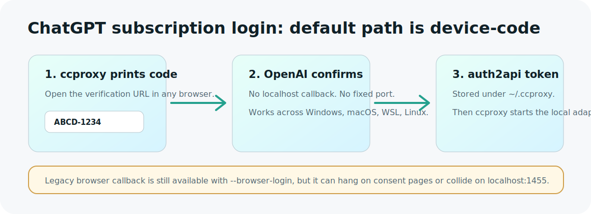

# claude-code-proxy

[English](README.md) | [简体中文](README.zh-CN.md)

用一个本地命令 `ccproxy`，让 Claude Code 在多个模型供应商之间切换。


`claude-code-proxy` 给 Claude Code 启动一个本地 Anthropic-compatible proxy，
再把请求转到 OpenAI-compatible、Anthropic-compatible 或本地 adapter 后端。
你不需要每次手动改 `ANTHROPIC_BASE_URL`。

## 这个工具解决什么

- **一个命令切换供应商：** `ccproxy model set`
- **OpenAI 两种模式分开：** OpenAI API key 计费和 ChatGPT 订阅登录不是一回事。
- **Windows/macOS/WSL/Linux 都能用：** Windows 上自动优先使用 `claude.cmd`，
  避开 PowerShell `.ps1` 执行策略问题。
- **密钥不进仓库：** API key 只读环境变量；ChatGPT 订阅 token 放在
  `~/.ccproxy`。

## 快速开始

先选你实际拥有的模型入口。

### ChatGPT 订阅

适合你想用 ChatGPT 订阅账号，而不是 OpenAI API key 账单。

```sh
python -m pip install git+https://github.com/shuaishuaiZhu-ai/claude-code-proxy.git
ccproxy model set --provider chatgpt-subscription --model ChatGPT5.5
ccproxy run -- -p "reply ccproxy-ok"
```

首次运行会进入 device-code 登录：终端显示一个 URL 和一次性 code。你在浏览器
打开 URL、输入 code，然后回到终端等待完成。这个默认流程不使用旧的
`localhost:1455` browser callback，因此不会卡在 Edge/Chrome 的 Codex consent
页面。

### OpenAI API Key

适合你有 OpenAI API key，并希望走正常 API 账单。

```sh
export OPENAI_API_KEY="your-openai-api-key"
python -m pip install git+https://github.com/shuaishuaiZhu-ai/claude-code-proxy.git
ccproxy model set --provider openai-key --model gpt-4.1
ccproxy run -- -p "reply ccproxy-ok"
```

PowerShell：

```powershell
$env:OPENAI_API_KEY="your-openai-api-key"
ccproxy model set --provider openai-key --model gpt-4.1
ccproxy run -- -p "reply ccproxy-ok"
```

### Kimi、智谱 GLM、MiniMax

```sh
export KIMI_API_KEY="your-kimi-key"
ccproxy model set --provider kimi --model moonshot-v1-128k
ccproxy run -- -p "reply ccproxy-ok"
```

智谱和 MiniMax 分别换成 `ZHIPU_API_KEY` / `zhipu`，或 `MINIMAX_API_KEY` /
`minimax-cn`。

## Provider Map


| 你手里有什么 | Provider | 模型示例 | 密钥来源 |
| --- | --- | --- | --- |
| OpenAI API key | `openai-key` | `gpt-4.1`, `gpt-4.1-mini` | `OPENAI_API_KEY` |
| ChatGPT 订阅 | `chatgpt-subscription` | `ChatGPT5.5`, `ChatGPT5.4` | 托管 device-code 登录 |
| Kimi / Moonshot API key | `kimi` | `moonshot-v1-128k` | `KIMI_API_KEY` |
| 智谱 GLM API key | `zhipu` | `glm-4-plus` | `ZHIPU_API_KEY` |
| MiniMax 中国区 API key | `minimax-cn` | `MiniMax-M2.7` | `MINIMAX_API_KEY` |
| MiniMax 国际区 API key | `minimax-global` | `MiniMax-M2.7` | `MINIMAX_API_KEY` |
| MiniMax Anthropic-compatible | `minimax-cn-anthropic`, `minimax-global-anthropic` | provider native | `MINIMAX_API_KEY` |
| 自己的 adapter | `custom` | adapter 暴露什么就用什么 | `CCPROXY_CUSTOM_API_KEY` 或本地策略 |

## 工作方式

Claude Code 发送 Anthropic Messages API 请求。`ccproxy` 在本地启动一个
Anthropic-compatible endpoint，把请求转换或透传到上游，并用干净的子进程环境启动
Claude Code：

```text
ANTHROPIC_BASE_URL=http://127.0.0.1:8082
ANTHROPIC_API_KEY=ccproxy
ANTHROPIC_AUTH_TOKEN=ccproxy
```

这样可以避免你 shell 里已有的真实 Anthropic key 被带入 proxy 运行。

## ChatGPT 订阅登录



`chatgpt-subscription` 默认使用 OpenAI Codex device-code 登录：

```sh
ccproxy model set --provider chatgpt-subscription --model ChatGPT5.5
```

终端会显示类似：

```text
Open this URL in your browser and enter the one-time code:
https://auth.openai.com/codex/device
Code: ABCD-1234
```

打开 URL，输入 code，然后等终端继续。这个流程不使用 `localhost:1455` callback。

如果你明确要测试旧的 browser callback 流程，可以显式打开：

```sh
ccproxy model set --provider chatgpt-subscription --model ChatGPT5.5 --browser-login
```

只有在你专门排查旧 Codex consent 页面或 callback 行为时，才建议使用
`--browser-login`。

## 常用命令

```sh
ccproxy init
ccproxy model set
ccproxy model current
ccproxy run -- -p "reply ccproxy-ok"
ccproxy doctor --profile chatgpt-subscription
ccproxy test --profile custom --claude
```

`ccproxy model set` 是主入口：选择 provider，必要时完成设置或登录，选择模型，
然后把当前 provider/model 保存到 `~/.ccproxy`。

状态文件：

- `~/.ccproxy/active.toml`：当前 provider profile
- `~/.ccproxy/models.toml`：每个 provider 当前选择的上游模型
- `~/.ccproxy/adapters/auth2api/auth/`：托管 ChatGPT 订阅 token

这些状态文件不会保存上游 API key。

## 从源码安装

```sh
git clone https://github.com/shuaishuaiZhu-ai/claude-code-proxy.git
cd claude-code-proxy
python -m pip install -e .
ccproxy --version
```

如果 `ccproxy` 不在 `PATH`：

```sh
python -m ccproxy model set
```

## 平台说明

| 平台 | 建议 |
| --- | --- |
| Windows PowerShell | 正常使用 `ccproxy`。`ccproxy run` 会优先用 `claude.cmd`，避开 `.ps1` 执行策略。 |
| Windows CMD | API-key 模式用 `set OPENAI_API_KEY=...`。 |
| macOS / Linux | API-key 模式用 `export OPENAI_API_KEY=...` 或对应 provider 变量。 |
| WSL | 尽量让 Claude Code、`ccproxy`、本地 adapter 都在同一个环境里运行。 |
| 远程/headless | ChatGPT 订阅优先用 device-code；API-key 设置页可用 `--no-open-login`。 |

## 排查问题

先跑：

```sh
ccproxy doctor --profile chatgpt-subscription
```

常见现象：

| 现象 | 含义 | 处理 |
| --- | --- | --- |
| Claude Code 显示 `Not logged in` | 你直接运行了 `claude`，不是通过 `ccproxy run`。 | 用 `ccproxy run -- -p "reply ccproxy-ok"`。 |
| 浏览器卡在 Codex consent 页面 | 你在旧 browser callback 流程里。 | 停止它，不带 `--browser-login` 重新运行。 |
| `codex_callback_port_1455: busy` | 旧 callback 端口被其他应用占用。 | device-code 登录不受影响；只有 `--browser-login` 才需要管它。 |
| API-key provider 拒绝保存 | 必需环境变量缺失。 | 设置 `OPENAI_API_KEY`、`KIMI_API_KEY`、`ZHIPU_API_KEY` 或 `MINIMAX_API_KEY`。 |
| custom adapter 连不上 | `custom` 由你自己管理进程。 | 启动 adapter，并确认 profile 的 `base_url` 可访问。 |

## 配置

创建或刷新用户配置：

```sh
ccproxy init
```

最小 profile 示例：

```toml
default_profile = "openai-key"

[server]
host = "127.0.0.1"
port = 8082

[profiles.openai-key]
type = "openai-compatible"
base_url = "https://api.openai.com/v1"
api_key_env = "OPENAI_API_KEY"

[profiles.openai-key.models]
big = "gpt-4.1"
middle = "gpt-4.1-mini"
small = "gpt-4.1-nano"
```

Profile 类型：

- `openai-compatible`：把 Anthropic Messages 请求转换成 OpenAI Chat
  Completions。
- `anthropic-compatible`：按 Anthropic 形态透传，只做鉴权和模型映射。
- `external-adapter`：OpenAI-compatible wire shape。`chatgpt-subscription`
  由 `ccproxy` 托管；`custom` 由用户自己管理。

更多内容见 [docs/providers.md](docs/providers.md) 和
[examples/ccproxy.example.toml](examples/ccproxy.example.toml)。

## 开发

```sh
python -m pip install -e .
python -m unittest discover -s tests -v
python -m compileall -q src tests scripts
```

可选 FastAPI 模式：

```sh
python -m pip install ".[server]"
ccproxy serve --fastapi
```

## License

MIT. See [LICENSE](LICENSE).

第三方名称、平台标识和文档素材归各自权利方所有。本项目独立维护，不隶属于
OpenAI、Anthropic、MiniMax、Moonshot AI、Zhipu AI、Microsoft、Apple 或 Linux
发行版。
