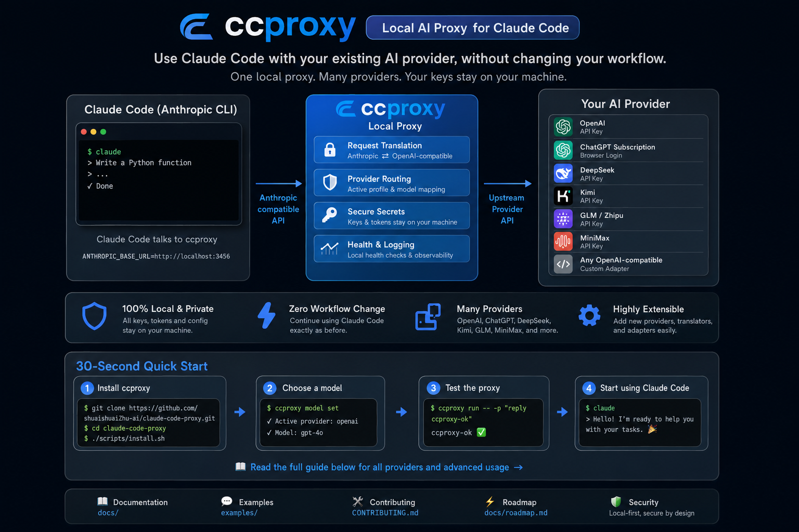
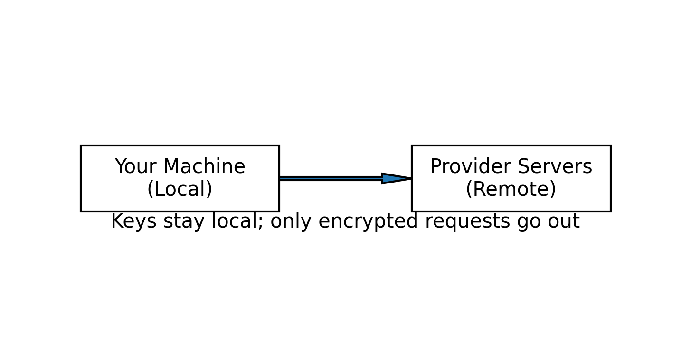

# claude-code-proxy

**使用你已有的 AI 账号，让 Claude Code 继续工作。**

<!-- 维持中英文链接 -->
[English](README.md) · [简体中文](README.zh-CN.md)

<!-- 封面图，描述通过本地代理连接多个提供商 -->


Claude Code 使用 Anthropic 的 Messages API，而许多 AI 提供商（如 OpenAI、DeepSeek、Kimi、智谱和 MiniMax）提供的是 OpenAI Chat Completions API；ChatGPT 订阅只能在浏览器中使用。`claude-code-proxy`（简称 `ccproxy`）在本机启动一个代理，将两种接口翻译成对方可以理解的形式。你无需更改工作流程，就可以继续使用 Claude Code 的工具和插件，凭借现有的账号或 API 密钥来驱动请求。所有密钥和令牌都保留在本机。

### 为什么使用 ccproxy？

如果你已经拥有任意 AI 服务账号或 API 密钥，又不想重装或修改 Claude Code 配置，可以考虑 ccproxy。它的优势包括：

* 只需选择一次提供商，Claude Code 的工具、插件等工作流程保持不变。
* API 密钥和订阅令牌留在本地，从不上传。
* 自动翻译 Anthropic 与 OpenAI 的请求格式，包含流式和工具调用。
* 支持多种提供商，可随时切换。

## 30 秒快速上手

PyPI 尚未发布 ccproxy，请从源代码安装并进行连接测试：

```sh
git clone https://github.com/shuaishuaiZhu-ai/claude-code-proxy.git
cd claude-code-proxy
sh scripts/install.sh        # 适用于 macOS、Linux 或 WSL
ccproxy model set            # 选择提供商并按提示粘贴密钥
ccproxy run -- -p "reply ccproxy-ok"
```

Windows PowerShell：

```powershell
git clone https://github.com/shuaishuaiZhu-ai/claude-code-proxy.git
cd claude-code-proxy
powershell -ExecutionPolicy Bypass -File .\scripts\install.ps1
ccproxy model set
ccproxy run -- -p "reply ccproxy-ok"
```

出现 `ccproxy-ok` 说明代理通路正常。安装脚本接受 `--with-server`、`--no-init` 等参数，具体见脚本本身。

## 选择提供商

根据你已有的账号或密钥选择一个配置文件。查看所有可用配置文件可以运行 `ccproxy profiles` 或 `ccproxy profiles --all`。

| 你已经拥有 | 选择的配置文件 | 说明 |
| --- | --- | --- |
| OpenAI API 密钥 | `openai-key` | 使用 `OPENAI_API_KEY` 环境变量或在 `ccproxy model set` 中粘贴并保存的密钥。 |
| ChatGPT 订阅 | `chatgpt-subscription` | 托管的本地适配器，需要 Node.js 20+ 和 git。订阅令牌保存在你的浏览器会话中。 |
| DeepSeek/Moonshot API 密钥 | `deepseek` | 与 OpenAI 兼容的端点。 |
| Kimi API 密钥 | `kimi` | 与 OpenAI 兼容的端点。 |
| 智谱 GLM API 密钥 | `zhipu` | 与 OpenAI 兼容的端点。 |
| MiniMax API 密钥 | `minimax-cn` 或 `minimax-global` | 根据账号所在地区选择。 |
| 自建适配器 | `custom` | 默认 `http://127.0.0.1:8000/v1`，可使用 `--base-url` 修改。 |

示例命令：

```sh
ccproxy model set --provider openai-key --model gpt-4-turbo
ccproxy model current        # 查看当前激活的提供商和模型
ccproxy model clear          # 清除已保存的密钥或订阅
ccproxy run --profile kimi --upstream-model moonshot-v1-128k -- -p "解释这个文件"
```

完整的提供商列表和模型名称见 [docs/providers.md](docs/providers.md)。

## 日常使用

配置好 profile 后，通过 ccproxy 运行 Claude Code：

```sh
ccproxy run -- -p "总结这个仓库"
ccproxy run -- --model sonnet -p "reply ccproxy-ok"    # 指定 Claude Code 使用的 Anthropic 模型
ccproxy serve --profile custom --port 8090              # 只启动代理供其他进程调用
```

`ccproxy run` 会在本地端口 8082（可配置）启动代理，设置子进程的 `ANTHROPIC_BASE_URL`，等待 Claude Code 退出后再关闭代理。

### ChatGPT 订阅

`chatgpt-subscription` 使用托管的适配器，通过浏览器或设备码登录。这 **不会** 把你的 ChatGPT 订阅转换为 OpenAI 平台 API 密钥。运行 `ccproxy model set --provider chatgpt-subscription` 会引导你完成登录流程。令牌保存在本机，从不上传。

## 本地安全边界



ccproxy 设计为本地 sidecar。代理默认仅监听 `127.0.0.1`。API 密钥可以通过环境变量提供，也可以在设置时粘贴，保存在 `~/.ccproxy/secrets.toml`。`ccproxy doctor` 会提示密钥是否存在，但不会打印其内容。使用 ChatGPT 订阅时，托管适配器把登录令牌保存在你的浏览器配置文件中。更多详情请见 [SECURITY.md](SECURITY.md)。

## 故障排查

首先运行诊断：

```sh
ccproxy doctor
ccproxy doctor --profile chatgpt-subscription
```

常见症状与解决方法：

| 症状 | 可能原因 | 解决方法 |
| --- | --- | --- |
| Claude Code 提示 `Not logged in` | 直接运行了 `claude`，环境变量未设置。 | 使用 `ccproxy run -- …`，以便设置环境。 |
| `/skills` 为空 | Claude Code 使用了 `--bare` 启动，禁用了工具。 | 启动时去掉 `--bare`。 |
| 密钥设置立即退出 | 按回车未粘贴密钥。 | 重新运行 `ccproxy model set` 并粘贴有效密钥。 |
| 浏览器授权页卡住 | 回调被阻塞或弹出了错误的标签页。 | 使用默认的设备码登录方式，除非确认 `--browser-login` 可以使用。 |
| 适配器无法连接 | 本地订阅适配器没有运行。 | 运行 `ccproxy model set`，启动适配器或切换到 API 密钥 profile。 |
| 端口冲突 | 端口被其他程序占用。 | 使用 `--port` 指定不同端口或关闭冲突进程。 |
| PowerShell 阻止脚本 | 执行策略过于严格。 | 运行安装/卸载脚本时使用 `-ExecutionPolicy Bypass`。 |

你可以通过模拟提供商来试验：

```sh
python scripts/mock_openai_provider.py --port 8000
ccproxy model set --provider custom --model custom-big
ccproxy run -- -p "reply ccproxy-ok"
```

## 深入了解

ccproxy 设计小巧，通过本地代理转换 Anthropic Messages 与 OpenAI Chat Completions（含流式和工具调用），并为需要的提供商启动托管适配器。

- **架构文档**： [docs/architecture.md](docs/architecture.md) 描述系统上下文、模块边界、请求翻译流程、提供商模型、适配器生命周期与扩展点。
- **提供商说明**： [docs/providers.md](docs/providers.md) 列出支持的提供商、设置链接和模型名。
- **测试**： [wiki/Testing.md](wiki/Testing.md) 介绍测试套件及其运行方式。
- **贡献指南**：请阅读 [CONTRIBUTING.md](CONTRIBUTING.md)，了解提交问题和 Pull Request 的要求。
- **路线图与技术债**： [docs/architecture-review.md](docs/architecture-review.md) 列出当前限制和计划改进。

## 贡献

欢迎提交 Pull Request！请先阅读 [CONTRIBUTING.md](CONTRIBUTING.md)，了解代码规范、测试方法以及参与方式。本项目维护中英文 README，修改任何一处内容都应保持两份文档结构一致。
