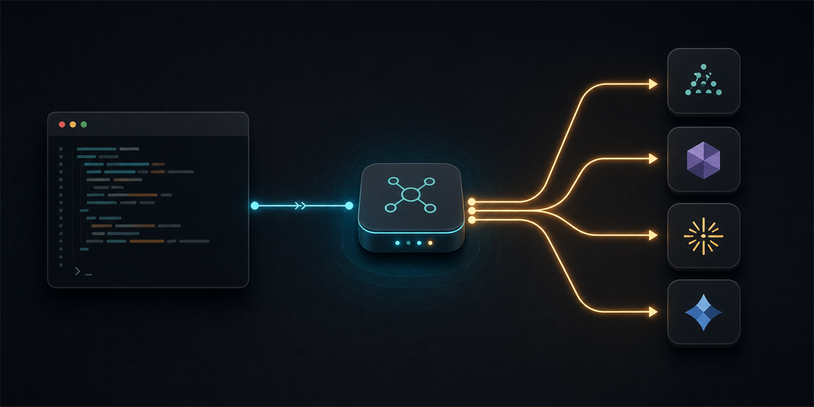
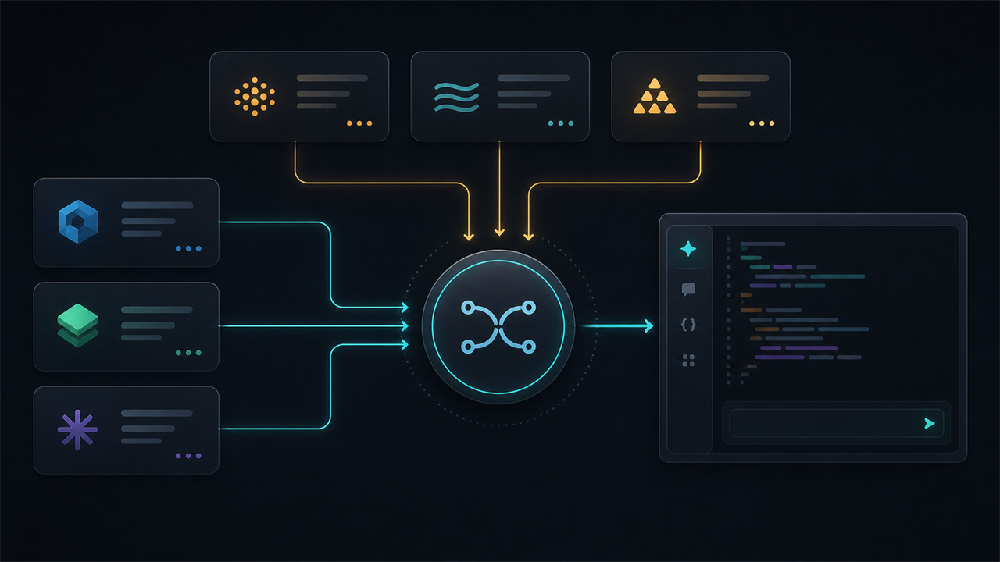

# claude-code-proxy

**让 Claude Code 走你已经在用的 provider。**

[English](README.md) · [简体中文](README.zh-CN.md)



`claude-code-proxy`（`ccproxy`）是在本机启动的 Anthropic-compatible 代理。
你只需要选一次 provider，之后无论上游是 OpenAI API key、ChatGPT 订阅、
DeepSeek、Kimi、智谱 GLM、MiniMax，还是你自己的 OpenAI-compatible adapter，
Claude Code 都走同一个本地入口。

日常使用只保留两步：

```sh
ccproxy model set
ccproxy run -- -p "reply ccproxy-ok"
```

Claude Code 仍然在本机运行。正常 `ccproxy run` 不会关闭你的 tools、plugins、
skills 或 MCP 配置，除非你自己给 Claude Code 传了禁用它们的参数。

## 30 秒上手

```sh
git clone https://github.com/shuaishuaiZhu-ai/claude-code-proxy.git
cd claude-code-proxy
sh scripts/install.sh
ccproxy model set
ccproxy run -- -p "reply ccproxy-ok"
```

Windows PowerShell：

```powershell
git clone https://github.com/shuaishuaiZhu-ai/claude-code-proxy.git
cd claude-code-proxy
powershell -ExecutionPolicy Bypass -File .\scripts\install.ps1
ccproxy model set
ccproxy run -- -p "reply ccproxy-ok"
```

如果输出里有 `ccproxy-ok`，说明这条代理链路已经跑通。当前还没有发布 PyPI 包，
安装方式仍然是从 git clone 的源码安装。

## 选一条 provider 路径



| 你手里有什么 | 选择这个 profile | 说明 |
| --- | --- | --- |
| OpenAI API key | `openai-key` | 使用 `OPENAI_API_KEY`，也可以在 `ccproxy model set` 时粘贴保存。 |
| ChatGPT 订阅 | `chatgpt-subscription` | 托管本地 adapter，需要 Node.js 20+ 和 git。 |
| DeepSeek API key | `deepseek` | OpenAI-compatible endpoint。 |
| Kimi / Moonshot API key | `kimi` | OpenAI-compatible endpoint。 |
| 智谱 GLM API key | `zhipu` | OpenAI-compatible endpoint。 |
| MiniMax API key | `minimax-cn` 或 `minimax-global` | 按你的账号区域选择。 |
| 自己的本地 adapter | `custom` | 默认指向 `http://127.0.0.1:8000/v1`。 |

常用命令：

```sh
ccproxy profiles
ccproxy profiles --all
ccproxy model set --provider deepseek --model deepseek-v4-pro
ccproxy model current
ccproxy model clear
```

完整 provider 列表和取 key 地址见 [docs/providers.md](docs/providers.md)。

## 安装和卸载

要求：

- Python 3.11+
- `pip`
- Claude Code CLI 在 `PATH` 中
- 只有使用 `chatgpt-subscription` 时才额外需要 Node.js 20+ 和 git

macOS、Linux、WSL：

```sh
sh scripts/install.sh
sh scripts/install.sh --with-server
sh scripts/install.sh --no-init
```

Windows PowerShell：

```powershell
powershell -ExecutionPolicy Bypass -File .\scripts\install.ps1
powershell -ExecutionPolicy Bypass -File .\scripts\install.ps1 -WithServer
```

安装脚本会执行 `pip install -e .`，并初始化 `~/.ccproxy`。如果不想初始化，
使用 no-init 选项。

卸载：

```sh
sh scripts/uninstall.sh
sh scripts/uninstall.sh --keep-state
```

```powershell
powershell -ExecutionPolicy Bypass -File .\scripts\uninstall.ps1
```

卸载 ccproxy 不会删除 Python、pip、Node.js、git 或 Claude Code。

## 让 Claude Code 走 ccproxy

`--` 后面的参数都会原样传给 Claude Code：

```sh
ccproxy run -- -p "summarize this repository"
ccproxy run -- --model sonnet -p "reply ccproxy-ok"
ccproxy run --profile kimi --upstream-model moonshot-v1-128k -- -p "explain this file"
```

`ccproxy run` 会启动本地代理，为子进程设置 `ANTHROPIC_BASE_URL`，等待
Claude Code 结束，然后关闭代理。

默认代理端口是 `8082`：

```sh
ccproxy run --port 8090 -- -p "reply ccproxy-ok"
```

也可以只启动代理，不启动 Claude Code：

```sh
ccproxy serve --profile custom --port 8090
```

## 本地安全边界


ccproxy 的定位是本地 sidecar：

- 默认只监听 `127.0.0.1`。
- API key 可以来自 `OPENAI_API_KEY` 这类环境变量。
- 粘贴保存的 key 放在 `~/.ccproxy/secrets.toml`。
- `ccproxy doctor` 只报告 key 是否存在，不打印 key 值。
- ChatGPT 订阅模式使用你的浏览器登录和托管本地 adapter；它不会把 ChatGPT 订阅变成 OpenAI Platform API key。

完整边界见 [SECURITY.md](SECURITY.md)。

## 排错

先跑诊断：

```sh
ccproxy doctor
ccproxy doctor --profile chatgpt-subscription
```

| 现象 | 可能原因 | 处理 |
| --- | --- | --- |
| Claude Code 报 `Not logged in` | 你跑了原生 `claude`，没有经过 `ccproxy run`。 | 使用 `ccproxy run -- ...`，让 `ANTHROPIC_BASE_URL` 被设置。 |
| `/skills` 看起来是空的 | Claude Code 启动时带了 `--bare`。 | 正常使用时去掉 `--bare`。 |
| API key 设置直接退出 | 粘贴了空 key。 | 重新跑 `ccproxy model set`，粘贴真实 key。 |
| 浏览器 consent 页面一直卡住 | 浏览器回调登录被拦截。 | 使用默认 device-code 登录，不要传 `--browser-login`。 |
| Adapter 连不上 | 本地订阅 adapter 没有运行。 | 跑 `ccproxy model set`、启动 adapter，或切到 API-key profile。 |
| 端口冲突 | 代理端口或回调端口被占用。 | 用 `--port` 改代理端口，或关闭占用回调端口的进程。 |
| PowerShell 拦截脚本 | 本地执行策略限制。 | 安装/卸载脚本加 `-ExecutionPolicy Bypass`。 |

没有真实 provider 也可以先试：

```sh
python scripts/mock_openai_provider.py --port 8000
ccproxy model set --provider custom --model custom-big
ccproxy run -- -p "reply ccproxy-ok"
```

## 工作原理

Claude Code 使用 Anthropic Messages API。大多数非 Anthropic provider 使用
OpenAI Chat Completions，或者通过本地 adapter 暴露接口。ccproxy 负责在这些
协议形状之间转换，包括流式响应和 tool-call payload。

实现细节看：

- [docs/architecture.md](docs/architecture.md)
- [wiki/zh-CN/Architecture.md](wiki/zh-CN/Architecture.md)
- [wiki/zh-CN/Providers-And-Models.md](wiki/zh-CN/Providers-And-Models.md)
- [wiki/zh-CN/Testing.md](wiki/zh-CN/Testing.md)

## 贡献

核心代码很小，运行时除了标准库没有必需依赖。FastAPI 和 uvicorn 只用于可选
server 模式。

常见入口：

| 目标 | 从这里开始 |
| --- | --- |
| 增加内置 provider | `src/ccproxy/presets.py`、`src/ccproxy/provider_setup.py`、`tests/test_provider_setup.py` |
| 修请求/响应转换 | `src/ccproxy/translator.py`、`tests/test_translator.py` |
| 优化 ChatGPT 订阅 adapter | `src/ccproxy/adapter.py`、`tests/test_adapter.py` |
| 优化 CLI 行为 | `src/ccproxy/cli.py`、`tests/test_cli.py` |

开 PR 前：

```sh
python -m pip install -e .
python -m unittest discover -s tests
python -m compileall -q src tests scripts
```

更多信息见 [CONTRIBUTING.md](CONTRIBUTING.md) 和
[docs/architecture-review.md](docs/architecture-review.md)。

## Roadmap

- 发布 PyPI 包。
- 增加 Windows、macOS、Linux 的 CI 覆盖。
- 把托管的 `auth2api` adapter pin 到 tag 或 commit。
- 增加结构化 logging，支持 debug 和 quiet 模式。
- 增加 `ccproxy doctor --fix`。
- 增加可选的 keyring secret 存储。

## License

MIT。详见 [LICENSE](LICENSE)。
