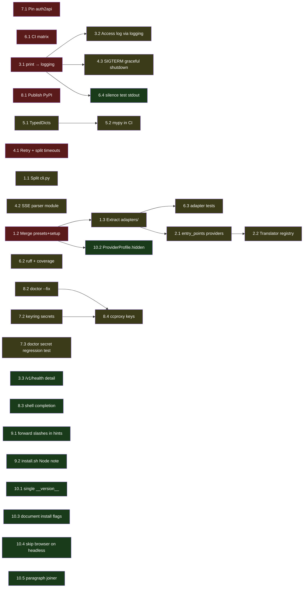

# Architecture Review — claude-code-proxy

> Snapshot date: 2026-05-22 · Repo state: 0.1.0 · Baseline: `python -m unittest discover -s tests` → **77 tests, OK**

This review reads the entire `src/ccproxy/**` tree (10 files, ~90 KB) plus
`scripts/`, `.github/workflows/`, `docs/`, and the wiki. The goal is to give
the maintainer a prioritized punch list — every item names the file/lines,
shows the issue, proposes a fix, and tags severity and effort.

---

## TOC

- [Top-level summary](#top-level-summary)
  - [What to keep](#what-to-keep)
  - [Top 5 to do first](#top-5-to-do-first)
  - [Suggested evolution path](#suggested-evolution-path)
- [1. Structure & responsibilities](#1-structure--responsibilities)
- [2. Extensibility](#2-extensibility)
- [3. Observability](#3-observability)
- [4. Robustness](#4-robustness)
- [5. Type safety](#5-type-safety)
- [6. Testing & CI](#6-testing--ci)
- [7. Security](#7-security)
- [8. Developer experience](#8-developer-experience)
- [9. Cross-platform](#9-cross-platform)
- [10. Small but worth fixing](#10-small-but-worth-fixing)
- [Dependency graph between items](#dependency-graph-between-items)

---

## Top-level summary

### What to keep

Do not "refactor" these away — they are the project's quiet strengths.

- **Zero runtime dependencies.** Everything (HTTP server, TOML, JWT decode,
  OAuth device-code) is `stdlib`. FastAPI/uvicorn are *optional*. This is
  exactly the right call for a tool that ships as a side-car for someone
  else's CLI. Adding `httpx`/`pydantic` "because it's nicer" would be a
  regression for shipping.
- **Frozen dataclasses everywhere.** `ProviderProfile`, `ProxyConfig`,
  `JsonResult`/`StreamResult`, `AdapterPaths`/`AdapterStatus`. Easy to test,
  hard to misuse. Keep the style for any new module.
- **Secrets discipline.** `cmd_doctor` only prints env-var *names*, never
  values (`cli.py:441-483`). `_request` puts the key in the `Authorization`
  header but never logs the request body (`client.py:91-98`). `SECURITY.md`
  declares the boundary clearly. Don't let any refactor regress this.
- **Translator is genuinely complete.** Streaming SSE, `input_json_delta` for
  tool inputs, tool-input schema validation that *converts* invalid calls
  into text instead of letting Claude crash (`translator.py:117-227,345-411`).
  Twenty-plus tests pin the behavior.
- **Bilingual docs in lockstep.** README + Wiki both have full zh-CN mirror.
  Few open-source projects do this on day one.
- **Tests run in 2.3 s with no network.** 77 tests, no flakes observed. This
  speed enables every later improvement on this list.

### Top 5 to do first

Ordered by impact ÷ effort. All five are P1-S — small, independent PRs you
can ship in an afternoon each.

1. **Pin `auth2api` to a tag or commit SHA** (`adapter.py:20`). Supply-chain
   risk + reproducibility. → [§7](#7-security)
2. **CI matrix: add `windows-latest` and `macos-latest`** (`ci.yml:10`).
   The codebase already has Windows-specific branches that nothing tests.
   → [§6](#6-testing--ci)
3. **Replace `print()` with `logging`** (76 call sites). Unblocks debug
   mode, access logs, and quieter tests. → [§3](#3-observability)
4. **Publish to PyPI** so the README opens with `pip install
   claude-code-proxy` instead of `git clone`. → [§8](#8-developer-experience)
5. **Merge `provider_setup.py` URLs into `presets.py`** as a `setup_url`
   field on `ProviderProfile`. Removes a duplicate-source-of-truth bug
   waiting to happen. → [§1](#1-structure--responsibilities)

### Suggested evolution path

| Milestone | Theme | Items |
|---|---|---|
| **0.1.x** | Ship-ready hygiene | Top 5 above, plus `connect_timeout`/`read_timeout` split, mypy on `secrets.py`+`config.py`+`env.py` |
| **0.2** | Module shape | Split `cli.py` into `cli/commands/`, extract `adapters/auth2api.py`, add `sse_parser.py`, write adapter unit tests |
| **0.5** | Extensibility | `entry_points("ccproxy.providers")` plugin API, `TranslatorProtocol` registry, `TypedDict` for Anthropic/OpenAI payloads |
| **1.0** | Polish | `ccproxy doctor --fix`, `keyring`-backed secrets with TOML fallback, shell completion, `/metrics`, i18n catalogs |

---

## 1. Structure & responsibilities

### 1.1 Split `cli.py` (28 KB) into command modules · P2 · M · independent

**Current** — `cli.py:60-166` builds every subparser inline; `cli.py:174-536`
holds 13 `cmd_*` handlers in one file. Subparser kwargs like
`--manual-login` / `--browser-login` / `--no-adapter-start` / `--no-open-login`
appear verbatim in 6 different subparsers (init, use, model set, serve, run,
test).

**Why fix** — Adding a new command means scrolling through ~650 lines.
The repeated subparser kwargs are an obvious code smell — easy to introduce
a divergence (e.g. one command keeps `--browser-login` working while another
drops it).

**Proposal**

```
src/ccproxy/
  cli/
    __init__.py        # re-exports main()
    parser.py          # build_parser + add_common_login_args helper
    commands/
      init.py          # cmd_init + register(subparsers)
      model.py         # cmd_model_set, cmd_model_current, cmd_model_clear
      run.py           # cmd_run + _run_claude_through_proxy
      serve.py         # cmd_serve
      doctor.py        # cmd_doctor
      test_cmd.py      # cmd_test
      profiles.py      # cmd_profiles, cmd_current, cmd_use
```

Each command file owns its own `register(subparsers)` function. `parser.py`
just loops over them. The shared `--manual-login/--browser-login/...` block
becomes one `add_login_args(parser)` helper.

**How to verify** — `python -m unittest discover -s tests` should still pass
without test edits because `from ccproxy.cli import main` is preserved.

---

### 1.2 Merge `provider_setup.py` URLs into `presets.py` · P1 · S · independent

**Current** — `presets.py:1-180` defines 14 `ProviderProfile` entries.
`provider_setup.py:17-28` redefines 10 of them as `ProviderSetup(label, url)`.
Adding a new provider means two edits.

```python
# provider_setup.py
API_KEY_SETUP: dict[str, ProviderSetup] = {
    "openai-key": ProviderSetup("OpenAI API keys", "https://platform.openai.com/api-keys"),
    "deepseek":   ProviderSetup("DeepSeek API keys", "https://platform.deepseek.com/api_keys"),
    ...
}
```

**Why fix** — The two files have already drifted: `openai` (alias of
`openai-key`) is in both, but `chatgpt-subscription` isn't in setup at all
(it's intentionally omitted but the asymmetry isn't obvious). Forgetting to
add a new provider to `provider_setup.py` makes its key-missing message
silently lose the URL.

**Proposal**

```python
# config.py
@dataclass(frozen=True)
class ProviderProfile:
    ...
    setup_label: str | None = None
    setup_url: str | None = None
    hidden: bool = False   # see §10.2

# presets.py
"deepseek": ProviderProfile(
    ...
    setup_label="DeepSeek API keys",
    setup_url="https://platform.deepseek.com/api_keys",
),
```

`provider_setup.py` collapses to one function (`provider_setup_message`)
that reads the fields off `profile`. Delete `API_KEY_SETUP`.

**How to verify** — `tests/test_provider_setup.py` covers all 5 cases; if
they still pass, the merge is behavior-equivalent.

---

### 1.3 Extract `adapters/` subpackage · P2 · M · depends on §1.2

**Current** — `adapter.py:1-470` mixes constants for *one specific* adapter
(auth2api), generic networking helpers (`_post_json_status`,
`_check_https_endpoint`), and process-management primitives.

**Proposal**

```
src/ccproxy/adapters/
  __init__.py
  base.py            # ManagedAdapterError, AdapterStatus, BaseManagedAdapter Protocol
  net.py             # _post_json_status, _check_https_endpoint, _is_port_in_use
  auth2api.py        # the existing ChatGPT subscription adapter
```

A `BaseManagedAdapter` protocol with `install() / login() / start() /
status() -> AdapterStatus` lets future adapters (Codex CLI, Claude's own
OAuth, ollama) follow the same shape. Until then, `auth2api` stays the only
implementation.

**P2 / M / depends on §1.2 mainly to ship after presets+setup are settled.**

---

## 2. Extensibility

### 2.1 No plugin entry point for providers · P2 · M · independent

**Current** — 14 providers hard-coded in `presets.py`. A user-edited
`~/.ccproxy/config.toml` *can* add a profile (`config.py:146-165`), but a
third-party package cannot register a `ProviderProfile` without forking.

**Proposal** — `pyproject.toml`:

```toml
[project.entry-points."ccproxy.providers"]
mistral = "ccproxy_mistral:profile"
```

In `config.py:load_config`, after merging PRESETS:

```python
for ep in importlib.metadata.entry_points(group="ccproxy.providers"):
    profile: ProviderProfile = ep.load()
    profiles.setdefault(profile.name, profile)
```

User TOML still wins (it's loaded last and overrides). This unlocks an
ecosystem without touching the core.

**P2 / M / yes.**

---

### 2.2 Protocol dispatch is hard-coded `if/elif` · P2 · S · pairs with §2.1

**Current** — `client.py:33-36`:

```python
def messages(self, body):
    if self.profile.type == "anthropic-compatible":
        return self._anthropic_passthrough(body)
    return self._openai_compatible(body)
```

**Why fix** — Gemini-style and Cohere-style endpoints both want their own
translation. Right now adding either means another `elif` in
`UpstreamClient`, plus translator functions inside `translator.py`.

**Proposal** — `Translator` protocol with `to_upstream(body, profile) ->
payload` and `from_upstream(response, body, profile) -> AnthropicMessage`,
registered in a dict keyed by `profile.type`. Existing OpenAI and Anthropic
translators move into `translators/openai.py` and `translators/anthropic.py`.

**P2 / S / pairs with §2.1.**

---

## 3. Observability

### 3.1 Replace `print()` with `logging` · P1 · S · enables 3.2/3.3 and 4.x

**Current** — 76 `print()` calls in `cli.py`, `adapter.py`, `server.py`,
`provider_setup.py`. Mixed `file=sys.stderr` and default stdout. No way to
silence, no way to set level, no way to redirect to a file.

The test suite even leaks these (`test_adapter` prints
`Codex device-code login failed: device failed` to the unittest output).

**Proposal**

```python
# ccproxy/logging.py
import logging, os, sys

def configure(verbose: bool = False) -> None:
    level = logging.DEBUG if verbose or os.environ.get("CCPROXY_DEBUG") else logging.INFO
    logging.basicConfig(
        level=level,
        format="%(levelname)s %(name)s: %(message)s",
        stream=sys.stderr,
    )

log = logging.getLogger("ccproxy")
```

Add `--debug` / `--quiet` to the root parser, call `configure()` in `main()`.

**Rule of thumb** — *Interactive UX* (the model set menu, "Paste API key:")
keeps `print()`. *Diagnostics / state changes* (`saved API key for ...`,
`starting auth2api on ...`) become `log.info()`. *Errors* become
`log.error()` so they survive stderr redirection but go off by default
under `--quiet`.

**P1 / S / yes.**

---

### 3.2 Stdlib server silences its access log · P2 · S · depends on §3.1

**Current** — `server.py:50-51`:

```python
def log_message(self, format, *args):
    return
```

Bypasses BaseHTTPRequestHandler logging entirely. Quiet output by default
is fine, but you lose the ability to debug "did Claude even reach the
proxy?".

**Proposal** — Route through `log.debug` instead of dropping. Add a
redacted request dump (Authorization header → `Bearer ***`) under debug.

**P2 / S / depends on §3.1.**

---

### 3.3 `/health` is too thin for diagnostics · P3 · S · independent

**Current** — `server.py:20-21,74-76` returns
`{"ok": True, "profile": ..., "provider_type": ...}`.

**Proposal** — Add `/v1/health` (without breaking `/health`):
`uptime_seconds`, `requests_total`, `errors_total`, `last_error_ts`,
`last_upstream_status`. Cheap to maintain (in-memory counters), huge for
support questions on issues. Optional `/metrics` in Prometheus text format
can come later.

**P3 / S / independent.**

---

## 4. Robustness

### 4.1 No retry; one global timeout · P1 · M · independent

**Current** — `client.py:29` constructor uses a single `timeout=120`.
`_post_json` and `_post_stream` propagate any HTTPError straight back.

```python
class UpstreamClient:
    def __init__(self, profile, timeout: int = 120) -> None:
```

**Why fix** — Upstream 5xx and 429 are common in practice (especially on
DeepSeek/GLM during peak hours). Bubbling them to Claude Code makes the CLI
look broken when retrying once would have worked. 120 s of "is it hanging?"
also feels broken on the connect step.

**Proposal**

- Split into `connect_timeout: float = 10` and `read_timeout: float = 120`.
- For non-stream JSON, retry once on 429 / 502 / 503 / 504 / connection
  reset, with `Retry-After` honored, capped at 1 extra attempt.
- Inject an `http_send: Callable` so tests can drive it without monkeypatching.

**P1 / M / independent.**

---

### 4.2 SSE parser is too forgiving · P2 · S · independent

**Current** — `client.py:114-125`:

```python
for raw_line in lines:
    line = raw_line.decode("utf-8", errors="replace").strip()
    if not line or line.startswith(":") or not line.startswith("data:"):
        continue
    ...
```

`.strip()` discards leading whitespace inside `data:` payloads; multi-line
`data:` lines (allowed by SSE spec, used by some providers) are dropped;
`event:` lines are ignored.

**Proposal** — Extract `ccproxy/sse_parser.py` that respects the SSE
spec: collect `data:` lines until a blank line, then emit one event. Cover
with unit tests using fixtures from real upstreams (DeepSeek, GLM, MiniMax).

**P2 / S / independent.**

---

### 4.3 No graceful shutdown on SIGTERM · P2 · S · depends on §3.1

**Current** — `cli.py:402-438` `_run_claude_through_proxy` spawns the proxy
in a daemon thread; `serve_stdlib` only catches `KeyboardInterrupt`.
SIGTERM (e.g. systemd, Docker) closes abruptly.

**Proposal** — Install signal handlers for SIGINT + SIGTERM in `cmd_serve`
and `cmd_run`; on signal call `httpd.shutdown()` (blocks until current
requests drain) then `server_close()`.

**P2 / S / depends on §3.1.**

---

## 5. Type safety

### 5.1 `dict[str, Any]` everywhere in the translator · P2 · M · enables §5.2

**Current** — `translator.py:40-114` operates on raw dicts with `.get`
defaults. Twenty-plus tests prove it works for the inputs they exercise,
but IDEs and reviewers cannot see what fields exist.

**Proposal** — Add `ccproxy/types.py` with stdlib `TypedDict`:

```python
class AnthropicContentText(TypedDict):
    type: Literal["text"]
    text: str

class AnthropicMessage(TypedDict, total=False):
    role: Literal["user", "assistant"]
    content: str | list[AnthropicContentText | AnthropicContentToolUse | AnthropicContentToolResult | AnthropicContentImage]

class AnthropicRequest(TypedDict, total=False):
    model: str
    max_tokens: int
    system: str | list[AnthropicContentText]
    messages: list[AnthropicMessage]
    tools: list[AnthropicTool]
    tool_choice: AnthropicToolChoice
    stream: bool
```

Same for OpenAI Chat Completions. No runtime change, just docstring-grade
typing. Stdlib only.

**P2 / M / yes.**

---

### 5.2 No `mypy` / `pyright` in CI · P2 · S · depends on §5.1

**Proposal** — Add a `mypy` step in CI starting from the small,
well-typed modules first: `secrets.py`, `config.py`, `env.py`,
`provider_setup.py`. Use `strict_optional = true`. Expand outwards once
§5.1 lands.

**P2 / S / depends on §5.1.**

---

## 6. Testing & CI

### 6.1 CI matrix is Linux-only · P1 · S · independent

**Current** — `.github/workflows/ci.yml`:

```yaml
runs-on: ubuntu-latest
strategy:
  matrix:
    python-version: ["3.11", "3.12", "3.13"]
```

Yet `cli.py:606-637` has Windows-specific `claude.cmd` resolution,
`adapter.py:228-247` has Windows-only `CREATE_NEW_PROCESS_GROUP`,
`secrets.py:67-70` chmod is a no-op on Windows. None of this is tested by
CI.

**Proposal**

```yaml
strategy:
  matrix:
    os: [ubuntu-latest, windows-latest, macos-latest]
    python-version: ["3.11", "3.13"]
runs-on: ${{ matrix.os }}
```

Two Python versions × three OSes = 6 jobs, still cheap.

**P1 / S / independent.**

---

### 6.2 No lint / format / coverage · P2 · S · independent

**Proposal** — Add `ruff` (handles lint + format in one tool, no
`black`/`isort`/`flake8` needed). Add a single CI step:

```yaml
- name: Lint
  run: |
    python -m pip install ruff
    ruff check src tests
    ruff format --check src tests
```

Coverage can use stdlib `coverage` to keep zero new prod deps:

```yaml
- name: Coverage
  run: |
    python -m pip install coverage
    coverage run -m unittest discover -s tests
    coverage report --fail-under=80
```

**P2 / S / independent.**

---

### 6.3 `adapter.py` is barely covered · P2 · M · depends on §1.3

**Current** — No `tests/test_adapter.py` for the OAuth flow or
`auth2api` lifecycle. The 9 KB `tests/test_adapter.py` that *does* exist
covers a different surface (need to confirm; CI passes 77 tests but
adapter.py is the riskiest file in the repo).

**Proposal** — Once §1.3 splits `adapter.py`, the pure functions
(`_post_json_status`, `_check_https_endpoint`, `_decode_jwt_payload`,
`_save_codex_token_response`) become trivially unit-testable with
`unittest.mock.patch("urllib.request.urlopen")`. Aim for 70% line coverage
on the new `adapters/` subpackage.

**P2 / M / depends on §1.3.**

---

### 6.4 Tests leak stdout · P3 · S · depends on §3.1

**Current** — Running `python -m unittest discover -s tests -v` ends with
lines like `Codex device-code login failed: device failed` that escape the
test runner.

**Proposal** — After §3.1, switch the noisy `print` lines to `log.info`
and use `assertLogs` in the relevant tests. The runner stays clean.

**P3 / S / depends on §3.1.**

---

## 7. Security

### 7.1 `auth2api` is not pinned · P1 · S · independent

**Current** — `adapter.py:20`:

```python
AUTH2API_REPO = "https://github.com/AmazingAng/auth2api.git"
```

`_install_auth2api` does `git clone <repo>` on the default branch, then
`npm install` + `npm run build`. No tag, no SHA, no integrity check.

**Why fix** — Two real failure modes:

1. Upstream pushes a breaking change to main → every `ccproxy init` after
   that breaks for new users, with no version pin to roll back to.
2. Upstream is compromised → arbitrary JS runs as the user, with access to
   their ChatGPT session token. Supply-chain blast radius is *high*
   because the resulting `auth2api` process holds an OAuth refresh token.

**Proposal**

```python
AUTH2API_REPO = "https://github.com/AmazingAng/auth2api.git"
AUTH2API_REF = "v0.4.2"   # or a 40-char commit SHA
...
_run_checked(
    [git, "clone", "--depth", "1", "--branch", AUTH2API_REF, AUTH2API_REPO, str(paths.repo)],
    ...
)
```

Also print `git rev-parse HEAD` of the installed adapter in `ccproxy
doctor`. Document the upgrade procedure in
`docs/architecture.md`.

**P1 / S / independent.**

---

### 7.2 Secrets are plaintext; `0o600` is a no-op on Windows · P2 · M · independent

**Current** — `secrets.py:67-70`:

```python
try:
    os.chmod(path, 0o600)
except OSError:
    pass
```

On NTFS, `os.chmod` only flips the read-only bit. Other local users (or
malware running as them) can still read `~/.ccproxy/secrets.toml`.

**Proposal**

- Prefer `keyring` when importable (add as `optional-dependencies.secure`).
  Fall back to the existing TOML.
- On Windows, set ACL to current user only via `icacls "$file" /inheritance:r /grant:r "$($env:USERNAME):F"` (one-shot in `_write_api_keys` on Windows).
- Print `secrets_storage: keyring` / `secrets_storage: toml` in `ccproxy
  doctor` so the user knows what they have.

**P2 / M / independent.**

---

### 7.3 (Already correct) Keys never enter logs · keep

**Current** — `cli.py:441-483` `cmd_doctor` deliberately prints only the
env-var *name*, never the value. `client.py:91-98` `_request` builds the
header inline and never logs the request body.

**Action** — Lock this in with a regression test:
`tests/test_doctor.py::test_doctor_never_prints_secret_value` that sets
`OPENAI_API_KEY="this-is-the-secret-sentinel"` and asserts the sentinel
does not appear in `ccproxy doctor` output. Cheap insurance against future
PRs that helpfully "improve" diagnostics.

**P2 / S / independent.**

---

## 8. Developer experience

### 8.1 `pip install claude-code-proxy` is missing · P1 · S · independent

**Current** — README and Wiki both open with `git clone`. The shortest
real path to ship is `git clone` → `install.sh` → `pip install -e .`. PyPI
is set up in `pyproject.toml` (`[project.scripts] ccproxy = ...`) but the
package is not published.

**Proposal**

- Add a `release.yml` GitHub workflow that publishes on tagged commits.
- README's "30-second TL;DR" becomes:

  ```sh
  pip install claude-code-proxy
  ccproxy model set
  ccproxy run -- -p "reply ccproxy-ok"
  ```

- Keep the `git clone` path in CONTRIBUTING for contributors.

**P1 / S / independent.**

---

### 8.2 `ccproxy doctor` is read-only · P2 · M · pairs with §8.4

**Current** — `cli.py:441-483` prints diagnostics. The next step is always
something the user has to do by hand.

**Proposal** — `ccproxy doctor --fix`:

- If `chatgpt-subscription` is selected and adapter not installed → run
  `ensure_chatgpt_adapter(...)`.
- If `api_key_env` is `missing` → prompt for paste (same code path as
  `_ensure_provider_ready`).
- If `secrets.toml` has stale keys for providers no longer used → offer to
  remove (interactive `y/N`).

**P2 / M / pairs with §8.4.**

---

### 8.3 No shell completion · P3 · S · independent

**Proposal** — Add `argcomplete` as optional dep. `install.sh` writes the
completion snippet to a comment-only "to enable: …" line so the user opts
in.

**P3 / S / independent.**

---

### 8.4 No `ccproxy keys list / rm / migrate` · P2 · S · pairs with §8.2

**Current** — Inspecting `~/.ccproxy/secrets.toml` requires opening the
file. Removing a stale key means hand-editing TOML.

**Proposal** — `ccproxy keys list` (env name + length only, never the
value) / `ccproxy keys rm OPENAI_API_KEY` / `ccproxy keys migrate
--to-keyring` (when §7.2 lands).

**P2 / S / pairs with §8.2.**

---

## 9. Cross-platform

### 9.1 Hard-coded backslashes in user-facing hint · P3 · S · independent

**Current** — `cli.py:567`:

```python
hint = "For a local fake adapter test from this repository, run: python scripts\\mock_openai_provider.py --port 8000"
```

On macOS/Linux the backslash is ugly noise. Python accepts forward
slashes on Windows too — there is no reason to special-case.

**Proposal** — Use `python scripts/mock_openai_provider.py --port 8000`
unconditionally. Same fix elsewhere if grep finds more.

**P3 / S / independent.**

---

### 9.2 `install.sh` doesn't pre-check Node/npm · P3 · S · independent

**Current** — `install.sh:47-50` warns about missing `claude` but says
nothing about `node`/`npm`/`git`. A user who picks `chatgpt-subscription`
later discovers the missing dep deep inside `_install_auth2api`.

**Proposal** — In `install.sh`, append a non-blocking note:

```
[ccproxy] note: ChatGPT subscription mode also needs Node 20+ and git.
[ccproxy] note: skip this if you only plan to use API-key providers.
```

`install.ps1` gets the same line. The actual check stays inside the
adapter (it's the right boundary).

**P3 / S / independent.**

---

## 10. Small but worth fixing

### 10.1 `__version__` is duplicated · P3 · S · independent

**Current** — `__init__.py:3` `__version__ = "0.1.0"` and
`pyproject.toml:7` `version = "0.1.0"`. They will drift the first time
someone bumps one and forgets the other.

**Proposal**

```python
# __init__.py
from importlib.metadata import PackageNotFoundError, version
try:
    __version__ = version("claude-code-proxy")
except PackageNotFoundError:   # editable install / not yet installed
    __version__ = "0.0.0"
```

**P3 / S / independent.**

---

### 10.2 `INTERACTIVE_PROFILE_EXCLUDES` is a magic set · P3 · S · depends on §1.2

**Current** — `cli.py:53-57`:

```python
INTERACTIVE_PROFILE_EXCLUDES = {
    "minimax-cn-anthropic",
    "minimax-global-anthropic",
    "openai",
}
```

Encodes "hide from the interactive menu" as a module-level literal.

**Proposal** — When §1.2 lands, add `hidden: bool = False` to
`ProviderProfile`. `_interactive_profile_names` filters on
`not profile.hidden`. Mark the three legacy profiles with `hidden=True`.
Delete the set.

**P3 / S / depends on §1.2.**

---

### 10.3 `install.sh --with-server` is undocumented · P3 · S · independent

**Current** — `install.sh:11`, `install.ps1:1-4` both accept
`--with-server` (installs FastAPI/uvicorn), `--no-init` (skip initial
config write). Neither is mentioned in README or Wiki.

**Proposal** — Document in the new README's installation section, with a
one-line "you usually don't need this" caveat for `--with-server`.

**P3 / S / independent.**

---

### 10.4 Device-code login always tries to open a browser · P3 · S · independent

**Current** — `adapter.py:204-219`. On headless SSH or in a container, the
browser open call is at best wasted, at worst confusing.

**Proposal** — Detect headless contexts (`os.environ.get("SSH_TTY") or not
os.environ.get("DISPLAY") and platform.system() == "Linux"`) and skip the
`webbrowser.open` call; the URL is already printed. Keep `--no-open-login`
for explicit control.

**P3 / S / independent.**

---

### 10.5 Multi-text-block assistant message loses paragraph boundaries · P3 · S · independent

**Current** — `translator.py:268-291` joins multiple `text` blocks with
`\n`:

```python
message: dict[str, Any] = {"role": "assistant", "content": "\n".join(part for part in text_parts if part) or None}
```

A single newline merges paragraphs that the model intended as separate.
For most providers this is harmless; for some prompts it changes downstream
formatting.

**Proposal** — Use `"\n\n".join(...)`, or — when OpenAI permits it — emit
`content` as a list of `{"type": "text", "text": ...}` blocks instead of
collapsing.

**P3 / S / independent.**

---

## Dependency graph between items



Red = P1, mustard = P2, green = P3. Arrows mean "do the source first, the
target gets easier."

---

## Closing thought

This codebase is small and consistent enough that **the dangerous failure
mode is over-engineering it**. Resist the urge to introduce a framework
(FastAPI as default, pydantic everywhere, async-everything). The
zero-dependency stdlib choice is the *feature* — keep it. The P1/P2 items
above are all additive: split files, add tests, register a plugin hook.
None of them require ripping the foundation out.
