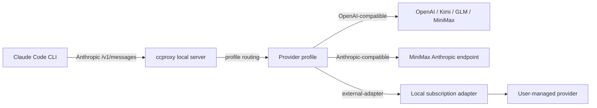

# Architecture

`ccproxy` keeps provider secrets outside the repository. Profiles reference an
environment variable name, and the runtime reads that variable immediately before
calling the upstream provider.

For OpenAI-compatible providers, `ccproxy` translates Anthropic Messages payloads
into Chat Completions payloads and maps the response back. For
Anthropic-compatible providers, the request is forwarded with only model mapping
and authentication applied.
