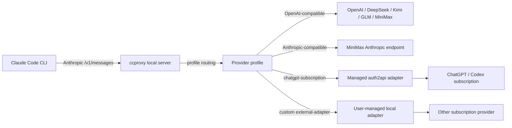

# Architecture

`ccproxy` keeps provider secrets outside the repository. Profiles reference an
environment variable name. The runtime reads that variable first, then falls
back to a user-pasted key saved under `~/.ccproxy/secrets.toml`.

For OpenAI-compatible providers, `ccproxy` translates Anthropic Messages payloads
into Chat Completions payloads and maps the response back. For
Anthropic-compatible providers, the request is forwarded with only model mapping
and authentication applied.

For ChatGPT subscription mode, `ccproxy` manages a local auth2api checkout under
`~/.ccproxy/adapters/auth2api`, runs the ChatGPT/Codex OAuth login flow when no
token exists, and starts auth2api on `http://127.0.0.1:8317`.
