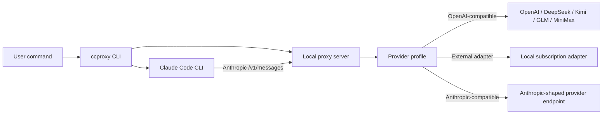

# Architecture

This page explains the project shape without requiring implementation details.

## Request Flow

`ccproxy run` starts a local Anthropic-compatible server, sets
`ANTHROPIC_BASE_URL`, and launches Claude Code with the arguments after `--`.

## Components

| Component | Role |
| --- | --- |
| CLI | Handles install-time choices, provider switching, diagnostics, and Claude launching. |
| Config | Stores profile and model state under `~/.ccproxy`. |
| Secrets | Reads environment variables first, then saved pasted keys. |
| Local server | Receives Claude Code `/v1/messages` requests. |
| Translator | Converts Anthropic Messages to OpenAI Chat Completions for compatible providers. |
| Upstream client | Sends requests to the selected provider or local adapter. |
| Managed adapter | Prepares and starts the ChatGPT subscription adapter when needed. |

## Provider Types

| Type | Behavior |
| --- | --- |
| `openai-compatible` | Convert Claude Code requests to OpenAI-compatible chat completions. |
| `external-adapter` | Use a local adapter that exposes OpenAI-compatible chat completions. |
| `anthropic-compatible` | Forward Anthropic-shaped requests with auth and model mapping. |

## Streaming And Tools

Claude Code uses streaming for many real runs. Tool calls are streamed as
Anthropic content blocks. The proxy maps OpenAI-compatible streaming deltas back
to Claude-compatible events, including `input_json_delta` for streamed tool
inputs.

Normal `ccproxy run` keeps Claude Code's tools, plugins, and skills available.
`--bare` is only for minimal smoke tests.

## State Files

| File | Purpose |
| --- | --- |
| `~/.ccproxy/config.toml` | Provider profile definitions. |
| `~/.ccproxy/active.toml` | Active provider. |
| `~/.ccproxy/models.toml` | Active upstream model per provider. |
| `~/.ccproxy/secrets.toml` | User-pasted API keys. |
| `~/.ccproxy/adapters/` | Managed adapter checkout and runtime state. |
