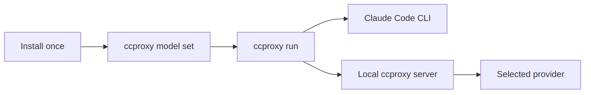

# claude-code-proxy Wiki

[English](Home.md) | [简体中文](zh-CN/Home.md)

`claude-code-proxy` lets Claude Code run through a local `ccproxy` command and
use different upstream providers without changing Claude Code itself.


## Start Here

1. Install the project.
2. Run `ccproxy model set`.
3. Choose a provider and model.
4. Run Claude Code through `ccproxy run`.

```sh
ccproxy model set
ccproxy run -- -p "reply ccproxy-ok"
```

## Wiki Pages

| Page | Use it when |
| --- | --- |
| [Quick Start](Quick-Start.md) | You want the shortest install and run path. |
| [Providers And Models](Providers-And-Models.md) | You need to choose OpenAI, ChatGPT subscription, DeepSeek, Kimi, GLM, MiniMax, or a local adapter. |
| [Subscription Login](Subscription-Login.md) | You use ChatGPT subscription mode or a subscription-backed adapter. |
| [Troubleshooting](Troubleshooting.md) | Claude shows login, skills, adapter, port, or API key errors. |
| [Architecture](Architecture.md) | You want to understand the local proxy shape at a high level. |
| [Testing](Testing.md) | You want to verify the install, a provider, or a code change. |

## Supported Paths

| You have | Choose |
| --- | --- |
| OpenAI API key | `openai-key` |
| ChatGPT subscription | `chatgpt-subscription` |
| DeepSeek API key | `deepseek` |
| DeepSeek subscription adapter | `deepseek-subscription` |
| Kimi / Moonshot API key | `kimi` |
| Kimi subscription adapter | `kimi-subscription` |
| Zhipu GLM API key | `zhipu` |
| Zhipu subscription adapter | `zhipu-subscription` |
| MiniMax China API key | `minimax-cn` |
| MiniMax Global API key | `minimax-global` |
| MiniMax Token Plan | `minimax-subscription` |
| Any OpenAI-compatible local adapter | `custom` |

## Normal Workflow



Use `ccproxy model set` again whenever you want to switch provider or model.
