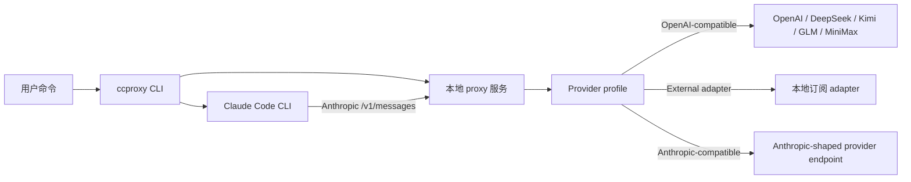

# 架构

这一页只解释项目的高层结构，不要求读者理解实现细节。

## 请求流程

`ccproxy run` 会启动本地 Anthropic-compatible 服务，设置 `ANTHROPIC_BASE_URL`，然后用 `--` 后面的参数启动 Claude Code。

## 组件

| 组件 | 作用 |
| --- | --- |
| CLI | 处理 provider 切换、诊断和 Claude Code 启动。 |
| Config | 在 `~/.ccproxy` 下保存 profile 和模型状态。 |
| Secrets | 优先读取环境变量，其次读取用户粘贴保存的 key。 |
| Local server | 接收 Claude Code 的 `/v1/messages` 请求。 |
| Translator | 把 Anthropic Messages 转成 OpenAI Chat Completions。 |
| Upstream client | 把请求发给选中的 provider 或本地 adapter。 |
| Managed adapter | 在需要时准备并启动 ChatGPT 订阅 adapter。 |

## Provider 类型

| 类型 | 行为 |
| --- | --- |
| `openai-compatible` | 把 Claude Code 请求转换为 OpenAI-compatible chat completions。 |
| `external-adapter` | 使用暴露 OpenAI-compatible chat completions 的本地 adapter。 |
| `anthropic-compatible` | 只做鉴权和模型映射，然后转发 Anthropic-shaped 请求。 |

## Streaming 和工具

Claude Code 的真实运行经常使用 streaming。工具调用会以 Anthropic content block 形式流式返回。proxy 会把 OpenAI-compatible streaming delta 映射回 Claude-compatible 事件，包括 streamed tool input 所需的 `input_json_delta`。

普通 `ccproxy run` 会保留 Claude Code 的工具、插件和 skills。`--bare` 只用于最小 smoke test。

## 状态文件

| 文件 | 作用 |
| --- | --- |
| `~/.ccproxy/config.toml` | Provider profile 定义。 |
| `~/.ccproxy/active.toml` | 当前 provider。 |
| `~/.ccproxy/models.toml` | 每个 provider 的当前上游模型。 |
| `~/.ccproxy/secrets.toml` | 用户粘贴保存的 API key。 |
| `~/.ccproxy/adapters/` | 托管 adapter 的 checkout 和运行状态。 |
