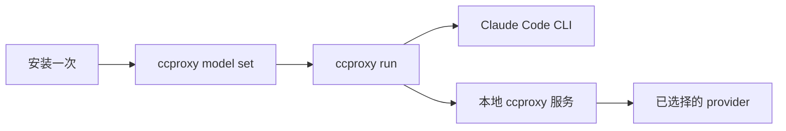

# claude-code-proxy Wiki

[English](../Home.md) | [简体中文](Home.md)

`claude-code-proxy` 让 Claude Code 通过本地 `ccproxy` 命令使用不同的上游模型供应商，而不需要改 Claude Code 本身。


## 从这里开始

1. 安装项目。
2. 运行 `ccproxy model set`。
3. 选择 provider 和模型。
4. 用 `ccproxy run` 启动 Claude Code。

```sh
ccproxy model set
ccproxy run -- -p "reply ccproxy-ok"
```

## Wiki 页面

| 页面 | 适合什么时候看 |
| --- | --- |
| [快速开始](Quick-Start.md) | 想最快安装并跑通。 |
| [供应商与模型](Providers-And-Models.md) | 需要选择 OpenAI、ChatGPT 订阅、DeepSeek、Kimi、GLM、MiniMax 或本地 adapter。 |
| [订阅登录](Subscription-Login.md) | 使用 ChatGPT 订阅模式或订阅型本地 adapter。 |
| [故障排查](Troubleshooting.md) | 遇到登录、skills、adapter、端口或 API key 问题。 |
| [架构](Architecture.md) | 想高层了解本地 proxy 的结构。 |
| [测试](Testing.md) | 想验证安装、provider 或代码改动。 |

## 支持的入口

| 你拥有的入口 | 选择 |
| --- | --- |
| OpenAI API key | `openai-key` |
| ChatGPT 订阅 | `chatgpt-subscription` |
| DeepSeek API key | `deepseek` |
| DeepSeek 订阅 adapter | `deepseek-subscription` |
| Kimi / Moonshot API key | `kimi` |
| Kimi 订阅 adapter | `kimi-subscription` |
| 智谱 GLM API key | `zhipu` |
| 智谱 GLM 订阅 adapter | `zhipu-subscription` |
| MiniMax 中国区 API key | `minimax-cn` |
| MiniMax 国际区 API key | `minimax-global` |
| MiniMax Token Plan | `minimax-subscription` |
| 任意 OpenAI-compatible 本地 adapter | `custom` |

## 常规流程



以后切换 provider 或模型，只需要重新运行 `ccproxy model set`。
